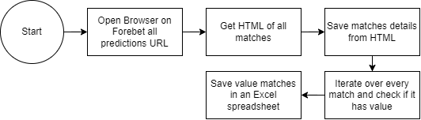

# Bet Assistant

### Requirements
#### Chrome beta at least v104 and corresponding chromedriver:
1. Install Chrome Beta from https://www.google.com/chrome/beta/
2. After installing Chrome Beta, access: "chrome://settings/help" and note the version
3. Download the corresponding chromedriver_win32.zip from here: https://chromedriver.chromium.org/downloads

### Usage Instructions
1. Inside your virtual python environment, run pip install -r requirements.txt
2. Note the paths of Chrome Beta and chromedriver and write them in the bet_assistant.py file
3. Run python bet_assistant.py
### Application flow  

