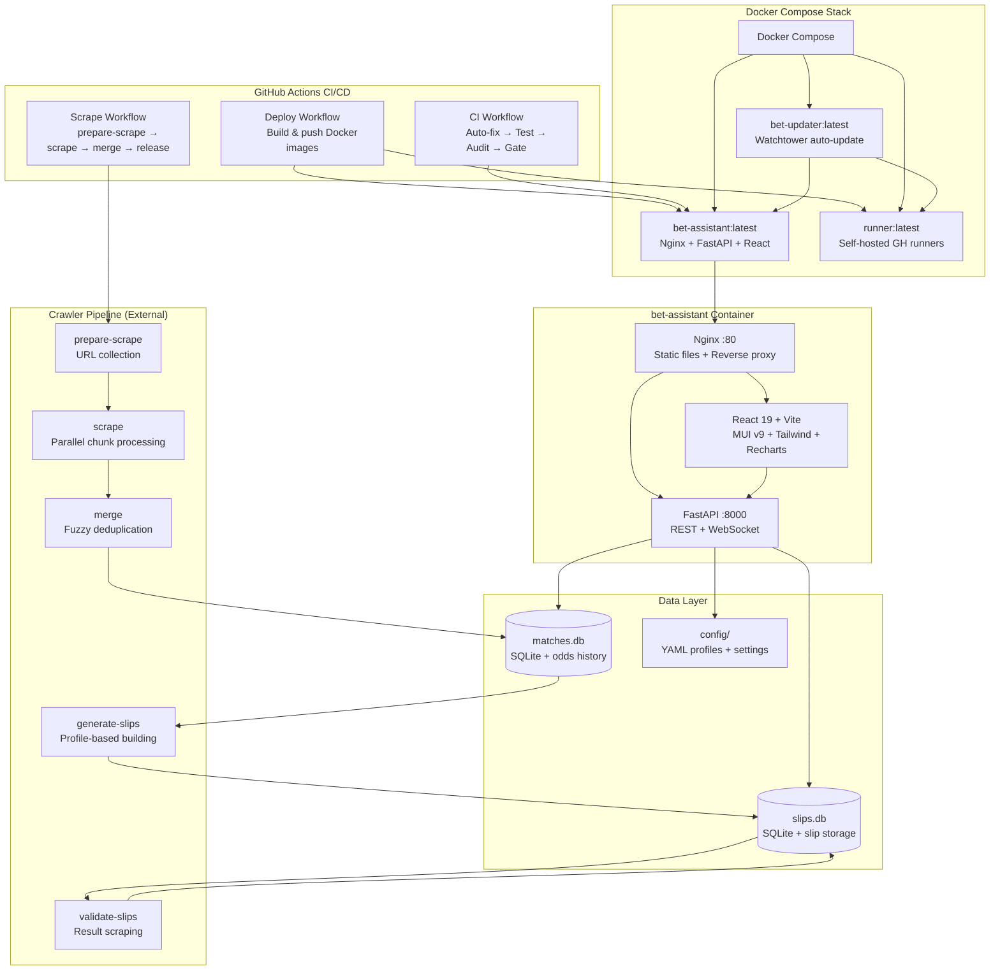

# 🎯 Bet Assistant

[](https://opensource.org/licenses/MIT)
[](https://www.python.org/downloads/)
[](https://nodejs.org/)
[](https://www.docker.com/)
[](https://react.dev/)
[](https://fastapi.tiangolo.com/)

A powerful, 24/7 automated betting intelligence platform. **Bet Assistant** crawls multiple sources, aggregates consensus data, calculates value pips, and manages your betting slips through a premium React dashboard.

---

## 📚 Documentation

| Document | Description |
|----------|-------------|
| [Architecture](docs/architecture.md) | System architecture, data flows, and component diagrams |
| [API Reference](docs/api.md) | Complete REST API and WebSocket documentation |
| [Deployment](docs/deployment.md) | Docker, Kubernetes, and production deployment guides |
| [Development](docs/development.md) | Local development setup and contribution guidelines |
| [Frontend](docs/frontend.md) | React dashboard architecture and component guide |
| [Backend](docs/backend.md) | FastAPI backend, services, and data models |
| [Crawler](docs/crawler.md) | ETL pipeline, finders, and scraping modes |
| [Infrastructure](docs/infrastructure.md) | Docker, CI/CD, and monitoring setup |

---

## 🚀 Key Features

*   **Multi-Source Aggregation**: 18+ intelligent crawlers for WhoScored, Forebet, SoccerVista, Vitibet, ScorePredictor, Predictz, WinDrawWin, OneMillionPredictions, xGScore, EaglePredict, LegitPredict, and more
*   **Consensus Engine**: Calculates betting "Consensus" based on agreement across providers with source-weighted Bayesian shrinkage
*   **Smart Slip Builder**: Dynamic generator that builds slips based on configurable risk profiles (Low, Medium, High, Value Hunter)
*   **Real-time Analytics**: Track success rate, market accuracy, ROI, Sharpe ratio, Kelly criterion, and drawdown over time
*   **Odds Movement Tracking**: Embedded odds history with significance detection (5% relative change or 0.10 absolute for low odds)
*   **24/7 Service Architecture**: Designed to run on Raspberry Pi or server with automated daily updates via GitHub Actions
*   **Premium Web UI**: High-performance React 19 dashboard with MUI v9, TailwindCSS, Recharts, and glassmorphism aesthetics
*   **WebSocket Real-time Updates**: Live match data, slip updates, and service status via push notifications
*   **Automated CI/CD**: GitHub Actions with self-hosted runners, multi-stage Docker builds, and Watchtower auto-updates

---

## 🏗️ System Architecture


```mermaid
graph TB
    subgraph "GitHub Actions CI/CD"
        GH1[Scrape Workflow
        prepare-scrape → scrape → merge → release]
        GH2[Deploy Workflow
        Build & push Docker images]
        GH3[CI Workflow
        Auto-fix → Test → Audit → Gate]
    end

    subgraph "Docker Compose Stack"
        DC[Docker Compose]
        BA[bet-assistant:latest
        Nginx + FastAPI + React]
        GR[runner:latest
        Self-hosted GH runners]
        BU[bet-updater:latest
        Watchtower auto-update]
    end

    subgraph "bet-assistant Container"
        NG[Nginx :80
        Static files + Reverse proxy]
        API[FastAPI :8000
        REST + WebSocket]
        UI[React 19 + Vite
        MUI v9 + Tailwind + Recharts]
    end

    subgraph "Data Layer"
        MDB[(matches.db
        SQLite + odds history)]
        SDB[(slips.db
        SQLite + slip storage)]
        CFG[config/
        YAML profiles + settings]
    end

    subgraph "Crawler Pipeline (External)"
        PS[prepare-scrape
        URL collection]
        SC[scrape
        Parallel chunk processing]
        MR[merge
        Fuzzy deduplication]
        GS[generate-slips
        Profile-based building]
        VS[validate-slips
        Result scraping]
    end

    GH1 --> PS
    PS --> SC
    SC --> MR
    MR --> MDB
    MDB --> GS
    GS --> SDB
    SDB --> VS
    VS --> SDB
    GH2 --> BA
    GH2 --> GR
    GH3 --> BA
    DC --> BA
    DC --> GR
    DC --> BU
    BA --> NG
    NG --> API
    NG --> UI
    API --> MDB
    API --> SDB
    API --> CFG
    UI --> API
    BU --> BA
    BU --> GR
```

---

## 🐳 Quick Start (Docker - Recommended)

### Prerequisites

*   Docker & Docker Compose installed
*   Git (to clone the repository)
*   GitHub Personal Access Token (for self-hosted runners - optional)

### Installation

```bash
# 1. Clone the repository
git clone https://github.com/rotarurazvan07/bet-assistant.git
cd bet-assistant

# 2. Configure environment (optional - for self-hosted runners)
cp setup/env.example .env
# Edit .env with your GitHub credentials

# 3. Launch the stack
docker compose -f setup/compose.yaml up -d
```

This starts three services:

| Service | Description | Port |
|---------|-------------|------|
| **bet-assistant** | Main application (Nginx + FastAPI + React) | 3002 |
| **runner** | GitHub Actions self-hosted runner | - |
| **bet-updater** | Watchtower for automatic image updates | - |

### Access the Dashboard

Open your browser and navigate to **`http://localhost:3002`**

### Stopping Services

```bash
docker compose -f setup/compose.yaml down
```

### Viewing Logs

```bash
# All services
docker compose -f setup/compose.yaml logs -f

# Specific service
docker compose -f setup/compose.yaml logs -f bet-assistant
```

### Data Persistence

The compose configuration mounts a `workspace` directory:

*   `./workspace/config/` — Profile configurations (copied from `/app/config/` on first launch)
*   `./workspace/data/` — SQLite databases (`matches.db`, `slips.db`)

**Important**: After first launch, edit files in `./workspace/config/` to customize settings.

---

## 🖥️ Dashboard Overview

The dashboard provides 5 main tabs:

```
┌─────────────────────────────────────────────────────────────┐
│  Dashboard Interface (http://localhost:3002)               │
├─────────────────────────────────────────────────────────────┤
│  [BETTING TIPS] [SMART BUILDER] [SLIPS] [ANALYTICS] [SERVICES] │
└─────────────────────────────────────────────────────────────┘
```

### 📊 Betting Tips Tab

Displays all available matches with consensus predictions and odds.

*   **Live Preview**: Matches update automatically via WebSocket
*   **Search & Filter**: By team name, minimum consensus, odds, date range
*   **Sortable Columns**: Click any header to sort
*   **Manual Slip Builder**: Click market cells to add selections to side panel
*   **Pagination**: 40 matches per page
*   **Odds Movement Indicators**: Visual up/down/stable badges with strength %

### 🧠 Smart Builder Tab

Intelligent engine that automatically constructs betting slips based on risk profiles.

**Configuration Panels:**

| Section | Key Settings |
|---------|--------------|
| **Bet Shape** | Target Odds, Target Legs, Max Overflow Legs |
| **Quality Gate** | Consensus Floor, Min Odds |
| **Markets** | 1, X, 2, O/U 0.5-4.5, BTTS, Double Chance |
| **Tolerance & Stop** | Tolerance Factor, Stop Threshold, Min Legs Fill Ratio |
| **Scoring** | Quality vs Balance, Consensus vs Sources (dual sliders) |
| **Advanced** | Consensus Shrinkage, Min Source Edge, Max Single Leg Odds, Asymmetric Tolerance |

**Profiles**: Save/load/delete named configurations with daily run scheduling.

### 📋 Slips Tab

All generated betting slips with full tracking.

*   **Slip Cards**: Profile, units, total odds, status (Won/Lost/Live/Pending)
*   **Leg Details**: Match, datetime, market, odds, live score
*   **Filters**: By profile, hide settled, live only
*   **Actions**: Validate Results (scrape scores), Generate Slips (run daily profiles)

### 📈 Analytics Tab

Deep performance insights with 6 metric cards and 8 chart types:

*   **History Tracking**: Cumulative profit, rolling win rate, ROI over time
*   **Market Statistics**: Profit contribution, accuracy by market
*   **Correlation Analysis**: Win rate by legs count, profile scatter plots
*   **Advanced Metrics**: Rolling edge trend, drawdown, return distribution, time patterns
*   **League Breakdown**: Performance by competition

### ⚙️ Services Tab

Manage automated background tasks:

*   **Service Cards**: Toggle crawlers on/off, view last run, match count
*   **Scheduled Hours**: Pull DB (data fetch) and Generate Slips (slip creation)
*   **Real-time Status**: Live/active indicators with next run countdown

---

## 🛠️ Manual Crawling with `crawl.py`

For custom operations or non-Docker environments:

```bash
python -m bet_crawler.crawl --mode <mode> [options]
```

| Mode | Purpose |
|------|---------|
| `prepare-scrape` | Collect match URLs from all active finders |
| `scrape` | Scrape match data from URLs into chunk DB |
| `merge` | Combine chunk DBs into final database |
| `generate-slips` | Build slips using a profile YAML |
| `validate-slips` | Scrape results and settle pending legs |

### Example: Full Pipeline

```bash
# 1. Collect URLs (cloud sources)
python -m bet_crawler.crawl --mode prepare-scrape --runners actions --config_dir config > tasks.json

# 2. Scrape chunks (example: first task)
python -m bet_crawler.crawl --mode scrape --matches_db_path chunk-1.db \
  --urls "$(jq -r '.[0].urls' tasks.json)" --config_dir config

# 3. Merge into final DB
python -m bet_crawler.crawl --mode merge --matches_db_path final.db \
  --chunks_dir ./ --config_dir config

# 4. Generate test slip
python -m bet_crawler.crawl --mode generate-slips \
  --matches_db_path final.db --slips_db_path test.db \
  --profile_path config/profiles/medium_risk.yaml

# 5. Validate results
python -m bet_crawler.crawl --mode validate-slips --slips_db_path test.db
```

---

## 🔧 Adding a New Finder

Bet Assistant's modular crawler architecture makes it easy to add new data sources.

### 1. Create the Finder Class

Create a new file in `bet_crawler/finders/` (e.g., `MyNewFinder.py`):

```python
from scrape_kit import get_logger
from bs4 import BeautifulSoup
from .BaseMatchFinder import BaseMatchFinder

logger = get_logger(__name__)

class MyNewFinder(BaseMatchFinder):
    TIMEZONE = "UTC"  # Source timezone

    def get_matches_urls(self):
        """Fetch and return list of match URLs to scrape."""
        from scrape_kit import browser
        with browser(solve_cloudflare=True) as session:
            page = session.fetch("https://example.com/previews")
            soup = BeautifulSoup(page.html_content, "html.parser")

        urls = []
        for link in soup.select("a.match-link"):
            href = link.get("href")
            if href:
                urls.append(f"https://example.com{href}" if href.startswith("/") else href)
        logger.info(f"Found {len(urls)} matches")
        return urls

    def get_matches(self, urls):
        """Main entry point for scraping."""
        from scrape_kit import scrape, ScrapeMode
        scrape(urls, self._parse_page, mode=ScrapeMode.FAST, max_concurrency=5)

    def _parse_page(self, url, html):
        """Parse a single match page and extract data."""
        try:
            soup = BeautifulSoup(html, "html.parser")
            home = soup.select_one(".home-team").text.strip()
            away = soup.select_one(".away-team").text.strip()
            dt_str = soup.select_one(".match-time")["datetime"]
            dt = datetime.fromisoformat(dt_str)
            dt = self.normalise_datetime(dt)

            odds_home = float(soup.select_one(".odds-home").text)
            odds_draw = float(soup.select_one(".odds-draw").text)
            odds_away = float(soup.select_one(".odds-away").text)

            from bet_framework.core.Match import Match, Score
            scores = [Score(source="mynewfinder", home=str(int(65)), away=str(int(25)))]
            odds = Odds(home=odds_home, draw=odds_draw, away=odds_away)

            match = Match(home_team=home, away_team=away, datetime=dt,
                         predictions=scores, odds=odds, result_url=url)
            self.add_match(match)
        except Exception as e:
            logger.error(f"Failed to parse {url}: {e}")
```

### 2. Register the Finder

Edit `bet_crawler/crawl.py` and add to `_CRAWLER_KEYS`:

```python
_CRAWLER_KEYS = {
    # ... existing entries ...
    "mynewfinder": lambda: _import("MyNewFinder"),
}
```

Add to runner sets:

```python
_RUNNER_SETS = {
    "actions": ["vitibet", "mynewfinder", ...],
    "local": ["whoscored", "forebet", "footballbettingtips"],
    "all": list(_CRAWLER_KEYS.keys()),
    "test": ["legitpredict"],
}
```

### 3. Test Your Finder

```bash
# Test in isolation
python -m bet_crawler.crawl --mode prepare-scrape --runners test --config_dir config

# Or test directly
python -c "
from bet_crawler.finders.MyNewFinder import MyNewFinder
f = MyNewFinder(print)
urls = f.get_matches_urls()
print(f'Found {len(urls)} URLs')
f.get_matches(urls[:3])
"
```

---

## 📁 Project Structure

```
bet-assistant/
├── bet_crawler/              # CLI crawler module
│   ├── crawl.py              # Main entry point with all modes
│   ├── finders/              # 18+ source-specific crawlers
│   │   ├── BaseMatchFinder.py
│   │   ├── WhoScoredFinder.py
│   │   ├── ForebetFinder.py
│   │   └── ...
│   └── crawl_core/           # Pipeline stages
│       ├── prepare_scrape.py
│       ├── scrape.py
│       ├── merge.py
│       ├── generate_slips.py
│       └── validate_slips.py
├── bet_dashboard/            # Web UI (React + FastAPI)
│   ├── frontend/             # React 19 + TypeScript + Vite
│   │   └── src/
│   │       ├── pages/        # Dashboard tabs (5 pages)
│   │       ├── components/   # Reusable UI components
│   │       ├── api/          # Backend API client (Axios)
│   │       ├── hooks/        # Custom React hooks
│   │       ├── config/       # Market configuration
│   │       ├── types/        # TypeScript interfaces
│   │       └── utils/        # Helper functions
│   └── backend/              # FastAPI server
│       ├── main.py           # App factory + lifespan
│       ├── routers/          # 8 API routers
│       │   ├── matches.py    # Match listing & filtering
│       │   ├── builder.py    # Slip preview & excluded URLs
│       │   ├── profiles.py   # Profile CRUD
│       │   ├── slips.py      # Slip CRUD + validation
│       │   ├── services.py   # Service management
│       │   ├── analytics.py  # Analytics calculations
│       │   ├── odds_history.py # Odds movement & history
│       │   └── system.py     # Health, pull, WebSocket
│       └── core/             # Backend core modules
│           ├── logic.py      # AppLogic - unified business logic
│           ├── ticker_service.py # Daemon thread polling
│           ├── ws.py         # WebSocket connection manager
│           ├── market_config.py # Market definitions
│           ├── schemas.py    # Pydantic request/response models
│           ├── analytics_utils.py # Statistics calculations
│           └── config_helpers.py # Profile YAML conversion
├── bet_framework/            # Core logic library
│   ├── BetAssistant.py       # Slip building, validation, storage
│   ├── MatchesManager.py     # SQLite buffer with fuzzy dedup
│   └── core/
│       ├── Match.py          # Match, Score, Odds data models
│       ├── Slip.py           # Slip, Leg, Config, Profiles
│       ├── consensus.py      # Consensus calculation engine
│       ├── scoring.py        # Pick scoring & ranking algorithm
│       ├── outcomes.py       # Result evaluation (Won/Lost/Live)
│       ├── types.py          # Enums: MarketType, Outcome, MarketLabel
│       ├── utils.py          # URL validation, datetime coercion
│       └── leagues.py        # League name constants
├── config/
│   ├── scraper_config.yaml   # Crawler keys, runner sets, skip patterns
│   ├── similarity_config.yaml # Team name fuzzy matching rules
│   └── profiles/             # YAML profiles for Smart Builder
├── setup/
│   ├── compose.yaml          # Docker Compose stack (3 services)
│   ├── Dockerfile            # Multi-stage: Node 22 → Python 3.11
│   ├── runner.Dockerfile     # Self-hosted GitHub runner image
│   ├── nginx.conf            # Reverse proxy + SPA routing
│   ├── start-dashboard.sh    # Entrypoint: nginx + uvicorn
│   └── requirements-*.txt    # Python dependencies
├── workspace/                # Created on first Docker run
│   ├── config/               # Copied from /app/config/
│   └── data/                 # SQLite databases
├── tests/                    # Unit & integration tests
├── .github/workflows/
│   ├── scrape.yml            # Daily scraping pipeline (8 jobs)
│   ├── deploy.yml            # Docker image build & push
│   └── cicd.yml              # Auto-fix, test, audit, gate
└── docs/                     # This documentation
```

---

## 🧠 Scoring Model Deep Dive

The Smart Builder uses a three-axis normalized scoring system:

### 1. Consensus Score
```
Linear mapping: consensus_floor → 100% = 1.0
```
Higher agreement across sources yields higher score.

### 2. Sources Score
```
0 sources → 0.0
max_sources_in_pool → 1.0
```
More independent providers increase confidence.

### 3. Balance Score
```
ideal_odds = (target_odds) ^ (1 / target_legs)
tolerance_band = ideal_odds ± (tolerance_factor × ideal_odds)

Within band: 1.0 (perfect)
At band edge: 0.0
Outside band: 0.0 (Tier 2)
```
Measures proximity to ideal per-leg odds.

### Combined Formula
```
quality = consensus_vs_sources × consensus_score + (1 − consensus_vs_sources) × sources_score
final   = quality_vs_balance × quality + (1 − quality_vs_balance) × balance_score
```

**Tier System**:
*   **Tier 1**: Balance score > 0 (within tolerance). Always ranked above Tier 2.
*   **Tier 2**: Balance score = 0 (outside tolerance). Used only if insufficient Tier 1 options.

**Advanced Features**:
*   **Bayesian Consensus Shrinkage**: `adjusted = 50 + (sources/(sources+k)) × (raw - 50)`
*   **Asymmetric Tolerance**: Separate lower/upper bands (default upper = 0.6 × lower)
*   **Odds Movement Adjustment**: Post-scoring boost/penalty based on odds direction
*   **Gaussian/Linear Decay**: Configurable balance penalty function

---

## 🔍 Troubleshooting

### No matches appearing in the dashboard

1.  Check backend container health:
    ```bash
docker compose -f setup/compose.yaml ps
    ```
2.  View backend logs:
    ```bash
docker compose -f setup/compose.yaml logs bet-assistant
    ```
3.  Verify database exists and has data:
    ```bash
sqlite3 workspace/data/matches.db "SELECT COUNT(*) FROM matches;"
    ```
4.  Ensure at least one finder is enabled in Services tab.

### Smart Builder returns "No matches meet the current criteria"

1.  Lower **Consensus Floor** (try 40–50%)
2.  Lower **Min Odds** (try 1.01)
3.  Check **Excluded Matches** section
4.  Verify global date filters aren't too restrictive
5.  Ensure matches exist in database for selected date range

### Docker containers keep restarting

```bash
docker compose -f setup/compose.yaml logs
```

Common issues:
*   Port 3002 or 8000 already in use → change ports in `compose.yaml`
*   Permission errors on `./workspace/` → ensure directory is writable

### Finders not collecting URLs

1.  Test finder in isolation: `python -c "from bet_crawler.finders.X import X; f=X(print); print(f.get_matches_urls())"`
2.  Check for Cloudflare blocks → some sources need `solve_cloudflare=True`
3.  Review `scraper_config.yaml` for custom retry/block indicators
4.  Ensure finder is registered in `crawl.py` and enabled in Services

### Validation fails to update leg status

1.  Confirm `result_url` is stored: `sqlite3 workspace/data/slips.db "SELECT result_url FROM legs LIMIT 3;"`
2.  Test scraping URL manually: `curl -s "https://example.com/match" | grep -i "score\|status"`
3.  Check parser in `_parse_match_result_html()` (BetAssistant.py) for source's HTML structure

---

## 🧪 Testing & Quality

```bash
# Backend tests
cd bet_dashboard/backend && python -m pytest tests/

# Frontend tests
cd bet_dashboard/frontend && npm test

# Linting
ruff check .                    # Python
cd bet_dashboard/frontend && npm run lint  # TypeScript
```

**CI Pipeline** (`.github/workflows/cicd.yml`):
1.  **Auto-fix**: autoflake, pyupgrade, autotyping, isort, ruff format/lint
2.  **Test**: pytest on Python 3.10/3.11/3.12 with coverage
3.  **Audit**: mypy, bandit, semgrep, pip-audit, radon, vulture, interrogate
4.  **Gate**: Consolidated report with GitHub annotations

---

## 📜 License

Distributed under the MIT License. See `LICENSE` for more information.

---

## 🙏 Acknowledgments

*   [scrape-kit](https://github.com/rotarurazvan07/scrape-kit) - Web scraping framework
*   [FastAPI](https://fastapi.tiangolo.com/) - Modern Python web framework
*   [React](https://react.dev/) - UI library
*   [MUI](https://mui.com/) - Material Design components
*   [Recharts](https://recharts.org/) - Charting library
*   [TailwindCSS](https://tailwindcss.com/) - Utility-first CSS
*   [Watchtower](https://containrrr.dev/watchtower/) - Auto-updating containers
