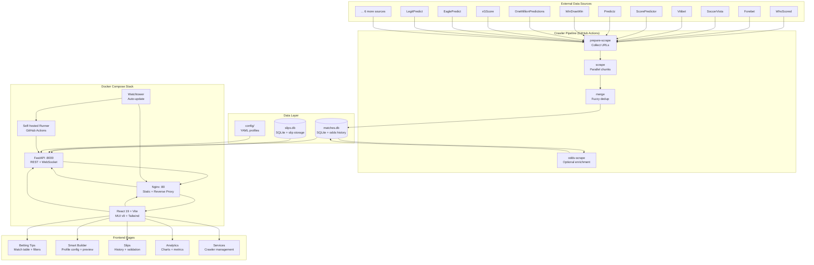
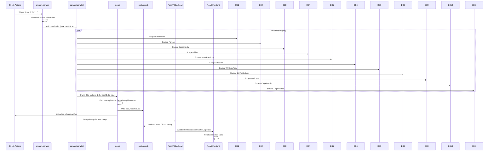
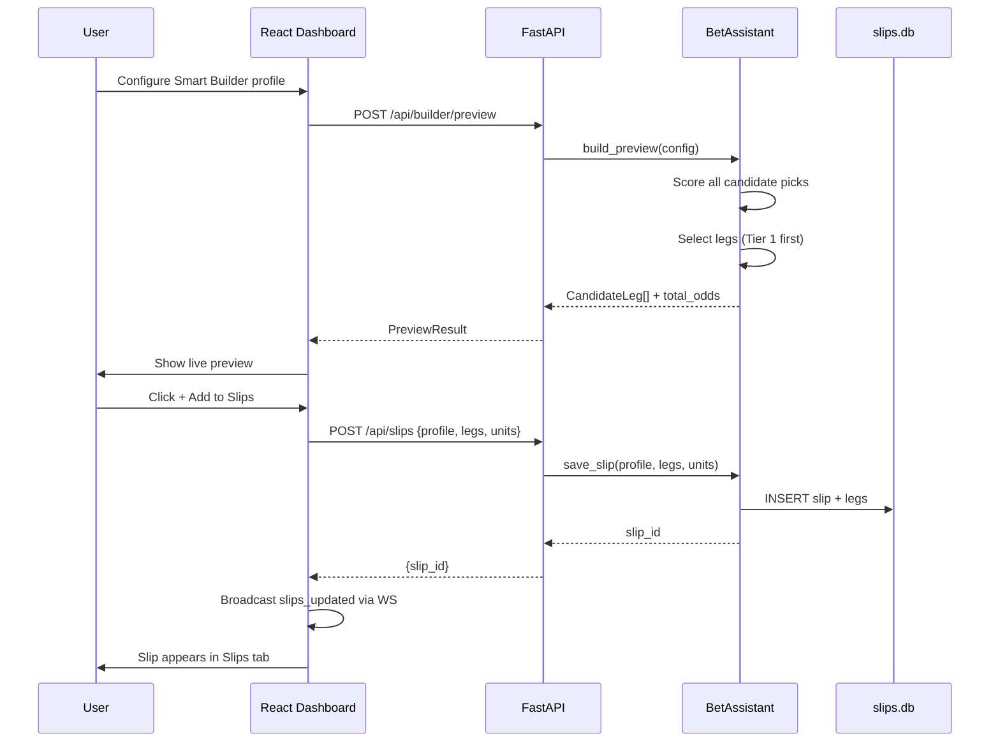
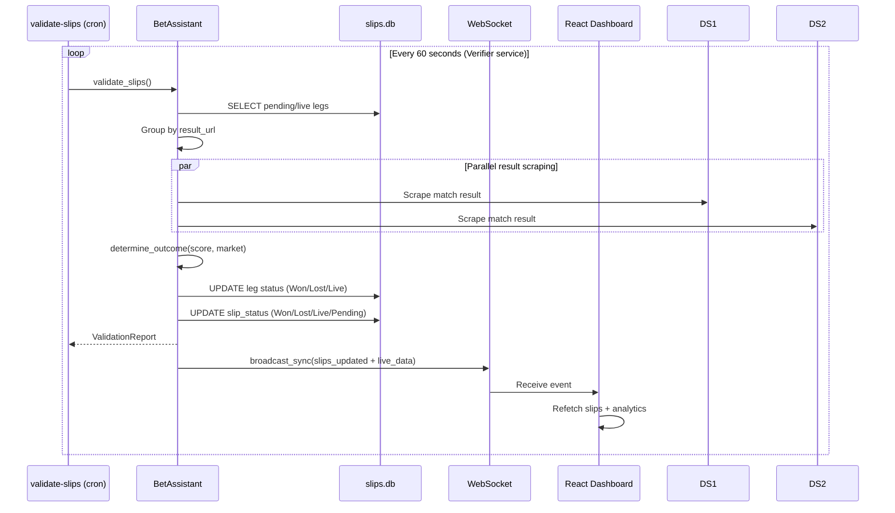
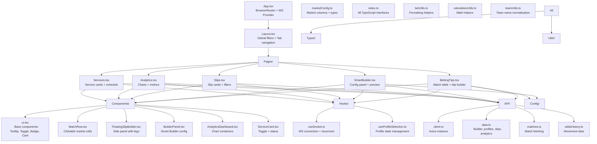
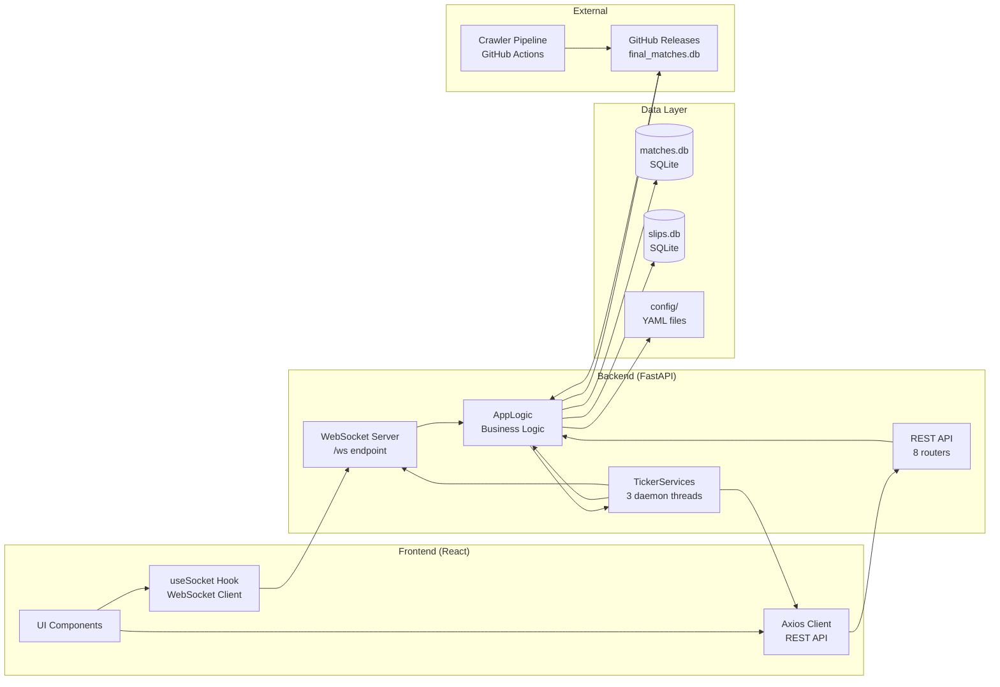
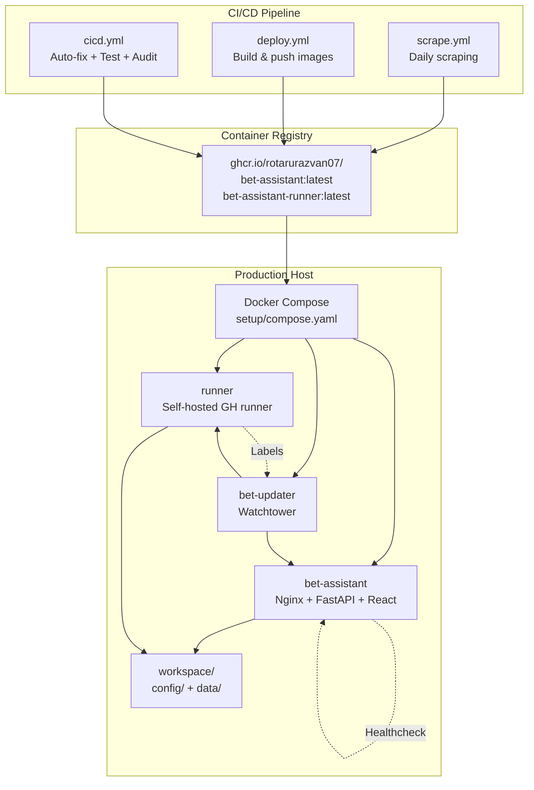

# System Architecture

## Overview

Bet Assistant is a **monorepo** containing four distinct but integrated parts:

| Part | Technology | Purpose |
|------|------------|---------|
| **Frontend** | React 19 + TypeScript + Vite | Premium betting dashboard UI |
| **Backend** | Python 3.11 + FastAPI | REST API + WebSocket real-time server |
| **Crawler** | Python + scrape-kit | ETL pipeline for match data aggregation |
| **Infrastructure** | Docker + GitHub Actions | Container orchestration + CI/CD |

---

## High-Level Architecture



---

## Data Flow Architecture

### 1. Crawler Pipeline (Daily Automated)



### 2. Slip Generation Flow



### 3. Real-time Validation Flow



---

## Component Architecture

### Frontend (React 19 + TypeScript)



### Backend (FastAPI + Python)

```mermaid
graph TD
    Main[main.py
    create_app() + lifespan]
    
    Routers[Routers/ 8 endpoints]
    MT[matches.py
    GET /api/matches]
    BL[builder.py
    POST /api/builder/preview
    GET /api/builder/excluded
    GET /api/builder/leagues]
    PR[profiles.py
    CRUD /api/profiles]
    SP[slips.py
    CRUD /api/slips
    POST /validate
    POST /generate]
    SV[services.py
    GET /api/services
    POST /settings
    POST /toggle]
    AN[analytics.py
    GET /api/analytics]
    OH[odds_history.py
    GET /api/odds-history]
    SY[system.py
    POST /api/pull
    GET /api/status
    WS /ws]
    
    Core[Core modules]
    LG[logic.py
    AppLogic - unified business logic
    TickerService orchestration]
    TS[ticker_service.py
    Daemon thread polling
    Predicate-based execution]
    WS[ws.py
    ConnectionManager
    Thread-safe broadcast]
    MC[market_config.py
    MarketDef + constants]
    SC[schemas.py
    Pydantic request/response]
    AU[analytics_utils.py
    Statistics calculations]
    CH[config_helpers.py
    Profile YAML conversion]
    
    Framework[bet_framework/]
    BA[BetAssistant.py
    Slip building + validation + storage]
    MM[MatchesManager.py
    Buffered SQLite + fuzzy dedup]
    CoreF[core/
    Match, Slip, Consensus, Scoring, Outcomes]
    
    Main --> Routers
    Routers --> MT
    Routers --> BL
    Routers --> PR
    Routers --> SP
    Routers --> SV
    Routers --> AN
    Routers --> OH
    Routers --> SY
    
    Main --> Core
    Core --> LG
    Core --> TS
    Core --> WS
    Core --> MC
    Core --> SC
    Core --> AU
    Core --> CH
    
    LG --> Framework
    LG --> BA
    LG --> MM
    BA --> CoreF
    MM --> CoreF
```

### Crawler (ETL Pipeline)

```mermaid
graph TD
    Crawl[crawl.py
    CLI entry + CrawlerFactory]
    
    Finders[Finders/ 18+ classes]
    BF[BaseMatchFinder
    Abstract base + datetime norm + skip patterns]
    WS[WhoScoredFinder
    Browser + JSON parsing]
    FB[ForebetFinder
    STEALTH mode + 100+ leagues]
    SV[SoccerVistaFinder
    Per league + per match]
    VT[VitibetFinder]
    SP[ScorePredictorFinder]
    PZ[PredictzFinder]
    WD[WinDrawWinFinder]
    OM[OneMillionPredictionsFinder]
    XG[xGScoreFinder]
    EP[EaglePredictFinder]
    LP[LegitPredictFinder]
    OP[OddsPortalFinder]
    BE[BetExplorerFinder]
    BT[BetClanFinder]
    FB2[FootballBettingTipsFinder]
    FP2[FootballPredictionsFinder]
    
    Core[Crawl Core/]
    PS[prepare_scrape.py
    URL collection + chunking]
    SC[scrape.py
    Domain grouping + parallel scrape]
    MR[merge.py
    Fuzzy dedup + validation]
    GS[generate_slips.py
    Profile-based slip building]
    VS[validate_slips.py
    Result scraping + settlement]
    
    Storage[Storage]
    SM[MatchesManager
    BufferedStorageManager
    SimilarityEngine]
    BA[BetAssistant
    BaseStorageManager
    Slip persistence]
    
    Crawl --> Finders
    Crawl --> Core
    
    Finders --> BF
    Finders --> WS
    Finders --> FB
    Finders --> SV
    Finders --> VT
    Finders --> SP
    Finders --> PZ
    Finders --> WD
    Finders --> OM
    Finders --> XG
    Finders --> EP
    Finders --> LP
    Finders --> OP
    Finders --> BE
    Finders --> BT
    Finders --> FB2
    Finders --> FP2
    
    Core --> PS
    Core --> SC
    Core --> MR
    Core --> GS
    Core --> VS
    
    PS --> Finders
    SC --> Finders
    SC --> Storage
    MR --> Storage
    GS --> Storage
    GS --> Framework
    VS --> Framework
    
    Storage --> SM
    Storage --> BA
    Framework --> BA
```



---

## Integration Architecture

### Multi-Part Communication



### Service Communication Matrix

| From | To | Protocol | Purpose |
|------|-----|----------|---------|
| Frontend | Backend | WebSocket | Real-time updates (matches, slips, services) |
| Frontend | Backend | REST (HTTPS) | CRUD operations, previews, analytics |
| Backend | SQLite | SQL | Match/slip data persistence |
| Backend | Config | File I/O | Profile/settings management |
| TickerServices | Backend | In-process | Polling predicates + callbacks |
| GitHub Actions | Backend | HTTP (Release API) | Database distribution |
| Watchtower | Docker | Docker API | Container auto-updates |
| Self-hosted Runner | GitHub | HTTPS | CI/CD job execution |

---

## Deployment Architecture



### Docker Multi-Stage Build

```mermaid
graph TD
    subgraph "Stage 1: Frontend Builder"
        FB[FROM node:22-alpine
        WORKDIR /app
        COPY package*.json .
        RUN npm ci
        COPY . .
        RUN npm run build
        OUTPUT: /app/dist]
    end

    subgraph "Stage 2: Python Dependencies"
        PD[FROM python:3.11-slim
        COPY requirements.txt .
        RUN pip install --prefix=/install -r requirements.txt
        OUTPUT: /install]
    end

    subgraph "Stage 3: Runtime"
        RT[FROM python:3.11-slim
        WORKDIR /app
        COPY --from=PD /install /usr/local
        RUN scrapling install
        COPY bet_framework/ ./bet_framework/
        COPY bet_dashboard/backend/ .
        COPY config/ config/
        COPY --from=FB /app/dist /usr/share/nginx/html
        COPY nginx.conf /etc/nginx/sites-available/default
        COPY start-dashboard.sh /usr/local/bin/
        EXPOSE 80
        CMD ["/usr/local/bin/start-dashboard.sh"]]
    end

    FB --> RT
    PD --> RT
```

---

## Security Architecture

```mermaid
graph TD
    subgraph "Network Security"
        NG[Nginx Reverse Proxy
        Rate limiting + SSL termination]
        CORS[CORS Middleware
        Allowlisted origins]
        HOST[HOST env var
        Default 127.0.0.1]
    end

    subgraph "Application Security"
        VAL[Pydantic v2
        Request validation]
        URLV[URL Validation
        is_valid_url()]
        SCHEME[URL Scheme Check
        HTTPS only for downloads]
        TEMP[Temp File Cleanup
        Best-effort unlink]
    end

    subgraph "Infrastructure Security"
        GH_TOKEN[GITHUB_TOKEN
        Least privilege]
        RUNNER[Self-hosted runners
        Isolated network]
        WATCH[Watchtower
        Label-scoped updates]
        HEALTH[Health Checks
        HTTP endpoint polling]
    end

    subgraph "CI/CD Security"
        AUDIT[Security Audit
        bandit + semgrep + pip-audit]
        TYPE[Type Checking
        mypy strict mode]
        DEPS[Dependency Scanning
        pip-audit CVE check]
        COMPLEX[Complexity Analysis
        radon CC + MI]
    end

    NG --> CORS
    NG --> HOST
    CORS --> VAL
    VAL --> URLV
    URLV --> SCHEME
    SCHEME --> TEMP
    
    GH_TOKEN --> RUNNER
    RUNNER --> WATCH
    WATCH --> HEALTH
    
    AUDIT --> TYPE
    TYPE --> DEPS
    DEPS --> COMPLEX
```

---

## Scalability Considerations

| Component | Current Scale | Scaling Strategy |
|-----------|---------------|------------------|
| **Frontend** | Single container | CDN for static assets, multiple replicas behind load balancer |
| **Backend** | Single container + daemon threads | Horizontal scaling with Redis for WebSocket pub/sub, shared SQLite → PostgreSQL |
| **Crawler** | GitHub Actions parallel jobs | Increase runner count, chunk size tuning, dedicated scraping infrastructure |
| **Database** | SQLite (file-based) | Migrate to PostgreSQL with connection pooling, read replicas |
| **WebSocket** | In-memory connection manager | Redis adapter for multi-instance broadcasting |
| **Scheduler** | Daemon threads (3 services) | External scheduler (Celery Beat, cron) for distributed deployment |

---

## Technology Decisions

| Decision | Rationale |
|----------|-----------|
| **React 19 + Vite** | Modern React with concurrent features, fast HMR, optimized builds |
| **FastAPI** | Async-native, automatic OpenAPI docs, Pydantic integration, high performance |
| **SQLite** | Zero-config, file-based, perfect for single-host deployment, embedded odds history |
| **Docker Multi-stage** | Small production images (~500MB), build-time dependency isolation |
| **GitHub Actions + Self-hosted** | Free CI/CD minutes, control over scraping environment, IP rotation |
| **Watchtower** | Zero-downtime auto-updates, label-scoped to bet-stack only |
| **scrape-kit** | Unified scraping framework with browser automation, Cloudflare solving |
| **MUI v9 + Tailwind** | Component library + utility CSS, glassmorphism design system |
| **Recharts** | React-native charting, declarative API, responsive |
| **Pydantic v2** | Fast validation, serialization, OpenAPI schema generation |

---

## Failure Modes & Mitigations

| Failure Mode | Detection | Mitigation |
|--------------|-----------|------------|
| **Crawler blocked by Cloudflare** | 0 URLs collected, scraper logs | `solve_cloudflare=True` in browser, rotate IPs via self-hosted runners |
| **Database corruption** | Healthcheck fails, SQLite errors | WAL mode, atomic writes, backup on merge |
| **WebSocket connection loss** | Frontend reconnect logic (3s delay) | Exponential backoff, ping interval (25s) |
| **Docker image pull fails** | Watchtower logs, container restart loop | Retry with backoff, fallback to previous image |
| **GitHub Actions runner offline** | Workflow failure, runner status | Multiple runner replicas, health monitoring |
| **Odds validation errors** | Implied probability > 120% | Market group validation, reject invalid odds |
| **Fuzzy match false positives** | Near-miss report (40-65 score) | Similarity config tuning, manual review |
