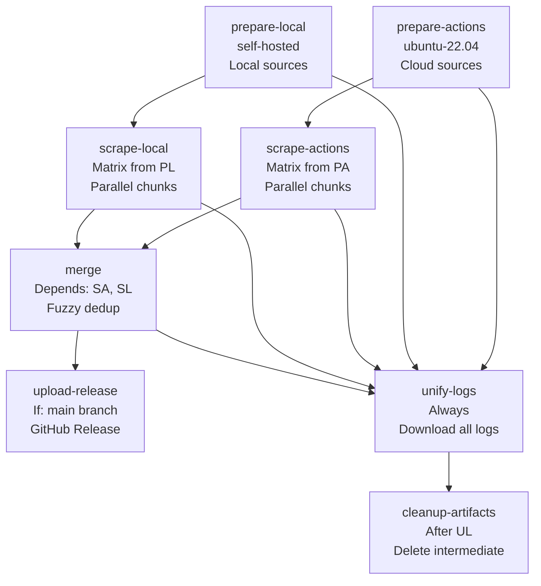

# Crawler Documentation

## Overview

The Bet Assistant crawler is a **Python ETL pipeline** built on **scrape-kit** that aggregates match predictions from 18+ betting sources, calculates consensus percentages, and stores data in SQLite with embedded odds history.

**Tech Stack**:
- Python 3.11+
- scrape-kit (browser automation, Cloudflare solving, parallel scraping)
- BeautifulSoup4 (HTML parsing)
- SQLite (chunk-based parallel processing)
- Fuzzy matching (team name deduplication)
- GitHub Actions (orchestration)

---

## Architecture

```mermaid
graph TD
    subgraph "Data Sources (18+)"
        WS[WhoScored]
        FB[Forebet]
        SV[SoccerVista]
        VT[Vitibet]
        SP[ScorePredictor]
        PZ[Predictz]
        WD[WinDrawWin]
        OM[OneMillionPredictions]
        XG[xGScore]
        EP[EaglePredict]
        LP[LegitPredict]
        OP[OddsPortal]
        BE[BetExplorer]
        BT[BetClan]
        FT[FootballBettingTips]
        FP[FootballPredictions]
    end

    subgraph "Crawler Pipeline (GitHub Actions)"
        PS[prepare-scrape
        Collect URLs]
        SC[scrape
        Parallel chunks]
        MR[merge
        Fuzzy dedup]    end

    subgraph "Storage"
        MDB[(matches.db
        SQLite + odds history)]
        SDB[(slips.db
        Slip storage)]
        CFG[config/
        YAML profiles]
    end

    WS --> PS
    FB --> PS
    SV --> PS
    VT --> PS
    SP --> PS
    PZ --> PS
    WD --> PS
    OM --> PS
    XG --> PS
    EP --> PS
    LP --> PS
    OP --> PS
    BE --> PS
    BT --> PS
    FT --> PS
    FP --> PS
    
    PS --> SC
    SC --> MR    MR --> MDB
    
    MDB --> BA[Backend API]
    SDB --> BA
    CFG --> BA
```

---

## Pipeline Modes

The crawler CLI (`bet_crawler/crawl.py`) supports 5 modes:

| Mode | Purpose | Parallel |
|------|---------|----------|
| `prepare-scrape` | Collect match URLs from all active finders | No |
| `scrape` | Scrape a chunk of URLs into a local SQLite DB | Yes (per domain) |
| `merge` | Combine all chunk DBs into a single final DB | No |
| `generate-slips` | Build slips using a profile YAML | No |
| `validate-slips` | Scrape results and settle pending legs | Yes (per result_url) |

### Standard Workflow

```bash
# 1. Prepare scrape (collect URLs)
python -m bet_crawler.crawl --mode prepare-scrape \
  --runners actions \
  --config_dir config

# 2. Scrape chunks (run in parallel)
python -m bet_crawler.crawl --mode scrape \
  --matches_db_path chunk-1.db \
  --urls "url1,url2,url3" \
  --config_dir config

# 3. Merge into final DB
python -m bet_crawler.crawl --mode merge \
  --matches_db_path final.db \
  --chunks_dir ./chunks \
  --config_dir config
```


## Finder Architecture

### BaseMatchFinder (`finders/BaseMatchFinder.py`)

**Abstract base class** that all 18+ finders inherit from.

**Key Features**:
- **Timezone normalization**: `TIMEZONE` class attribute (UTC, Asia/Bangkok, Europe/London, etc.)
- **Skip patterns**: Regex patterns to filter youth/women/reserve teams
- **Date validation**: Only matches within `num_days_ahead` window
- **Source collision guard**: Prevents duplicate sources for same match
- **Callback-based**: `add_match_callback` for buffered storage

```python
class BaseMatchFinder:
    TIMEZONE: str | None = None  # Subclasses override
    
    def __init__(self, add_match_callback, **runtime_settings):
        self.add_match_callback = add_match_callback
        self.contributes_odds = runtime_settings["contributes_odds"]
        self.top_leagues_only = runtime_settings["top_leagues_only"]
        self.num_days_ahead = runtime_settings["num_days_ahead"]
        self.local_timezone = runtime_settings["local_timezone"]
        self.skip_patterns = runtime_settings["skip_patterns"]
    
    @abstractmethod
    def get_matches_urls(self): pass
    
    @abstractmethod
    def get_matches(self, urls): pass
    
    @abstractmethod
    def _parse_page(self, url, html): pass
    
    def normalise_datetime(self, dt):
        # Convert from source timezone to local timezone
    
    def add_match(self, match, force=False):
        # Skip patterns + date validation + callback
    
    def skip_match_by_patterns(self, home, away):
        # Regex matching against skip_patterns
    
    def validate_match_date(self, match_datetime):
        # today <= match_date <= today + num_days_ahead
```

### Key Finder Implementations

#### WhoScoredFinder (`finders/WhoScoredFinder.py`)
- **Mode**: Browser-based (JavaScript rendering required)
- **Concurrency**: 3 (Cloudflare protection)
- **Parsing**: Embedded JSON (`matchHeaderJson`) + DOM for scores
- **Timezone**: UTC
- **Odds**: No (predictions only)

#### ForebetFinder (`finders/ForebetFinder.py`)
- **Mode**: STEALTH (fast, no browser)
- **Concurrency**: 10
- **Leagues**: 30+ top leagues (configurable via `TOP_LEAGUES` dict)
- **All Links**: 100+ country/league URLs
- **Timezone**: Auto-detected local timezone
- **Odds**: Yes (1X2 + Over/Under)
- **Parsing**: HTML table rows with `rcnt` class

#### SoccerVistaFinder (per_league + per_match)
- **Mode**: Two-phase (league list → match details)
- **Parsing**: League pages → match detail pages
- **Odds**: Yes

#### Other Finders
Each finder implements the three abstract methods with source-specific parsing logic. Common patterns:
- `browser(solve_cloudflare=True)` for protected sites
- `scrape(urls, _parse_page, mode=ScrapeMode.FAST/STEALTH, max_concurrency=N)`
- `Score(source, home, away)` for predictions
- `Odds(home, draw, away, ...)` for bookmaker odds
- `Match(home_team, away_team, datetime, predictions, odds, result_url, league)`

---

## Configuration

### scraper_config.yaml

```yaml
CRAWLER_KEYS:
  whoscored:
    class: "WhoScoredFinder"
    contributes_odds: false
  forebet:
    class: "ForebetFinder"
    contributes_odds: true
  # ... 18+ finders

RUNNER_SETS:
  actions: [vitibet, scorepredictor, predictz, soccervista, win_draw_win, one_million_predictions, xg_score, eagle_predict, legit_predict]
  local: [whoscored, forebet, football_betting_tips]
  all: [all keys]
  test: [legit_predict]

MAX_CHUNK_SIZE:
  actions: 100
  local: 1
  all: 1
  test: 1

SKIP_PATTERNS:
  - pattern: "\\bU\\d{2}s?\\b"
    description: "Youth team"
  - pattern: "\\bW\\b"
    description: "Women's team"
  - pattern: "\\bII\\b"
    description: "Reserve team II"
  # ... custom patterns per source

num_days_ahead: 3
local_timezone: "Europe/Bucharest"
```

### similarity_config.yaml

```yaml
threshold: 65
synonyms:
  "Man City": "Manchester City"
  "Man Utd": "Manchester United"
  "Spurs": "Tottenham"
  # ... team name normalization rules
```

---

## Data Models

### Match (`bet_framework/core/Match.py`)

```python
@dataclass
class Score:
    source: str
    home: float
    away: float

@dataclass
class Odds:
    home: float = None
    draw: float = None
    away: float = None
    over_05: float = None
    under_05: float = None
    over_15: float = None
    under_15: float = None
    over_25: float = None
    under_25: float = None
    over_35: float = None
    under_35: float = None
    over_45: float = None
    under_45: float = None
    btts_y: float = None
    btts_n: float = None
    dc_1x: float = None
    dc_12: float = None
    dc_x2: float = None
    # Auto-converts American odds to decimal

class Match:
    def __init__(self, home_team, away_team, datetime, predictions, odds, result_url, league):
        self.home_team = home_team
        self.away_team = away_team
        self.datetime = datetime
        self.predictions = predictions  # List[Score]
        self.odds = odds  # Odds
        self.result_url = result_url
        self.league = league
```

### Consensus Calculation (`bet_framework/core/consensus.py`)

```python
def calc_consensus(scores: list) -> dict:
    """Derive consensus percentages from predicted scores."""
    # Result: home/draw/away
    # Over/Under: 0.5, 1.5, 2.5, 3.5, 4.5
    # BTTS: yes/no
    # Double Chance: 1X/12/X2
    return {
        "result": {"home": 65.0, "draw": 20.0, "away": 15.0},
        "over_under_25": {"over": 70.0, "under": 30.0},
        # ...
    }
```

---

## Storage Layer

### MatchesManager (`bet_framework/MatchesManager.py`)

**Buffered SQLite with fuzzy deduplication.**

```python
class MatchesManager(BufferedStorageManager):
    def __init__(self, db_path, similarity_config=None):
        self.similarity_engine = SimilarityEngine(similarity_config) if similarity_config else None
        super().__init__(db_path, "matches")
    
    def add_match(self, match: Match) -> int | None:
        # 1. Fuzzy match in buffer (±1 day)
        # 2. Exact match → update
        # 3. Fuzzy match (similarity >= 65) → update
        # 4. Source collision guard
        # 5. Insert new or update existing
        # 6. Return buffer index
    
    def merge_databases(self, chunks_dir):
        # Merge chunk DBs with fuzzy dedup
        # Log near-misses (40-65 similarity)
        # Validate odds implied probability (95-120%)
    
    def merge_with_history_preservation(self, fresh_db_path, max_history=3, local_tz="UTC"):
        # Preserve odds history when merging fresh DB
        # Transfer existing history + append current snapshot
```

### Database Schema

```sql
CREATE TABLE matches (
    id INTEGER PRIMARY KEY AUTOINCREMENT,
    home_team_name TEXT NOT NULL,
    away_team_name TEXT NOT NULL,
    datetime TEXT NOT NULL,
    predictions_scores TEXT,  -- JSON
    odds TEXT,                -- JSON with history
    result_url TEXT,
    league TEXT
);
CREATE INDEX idx_datetime ON matches(datetime);
CREATE INDEX idx_home_team ON matches(home_team_name);
CREATE INDEX idx_away_team ON matches(away_team_name);
```

**Odds JSON with History**:
```json
{
  "home": 1.85,
  "draw": 3.40,
  "away": 4.20,
  "over_25": 1.75,
  "under_25": 2.10,
  "history": [
    {"ts": "2026-08-22T10:00:00", "home": 1.90, "draw": 3.30, "away": 4.00},
    {"ts": "2026-08-22T15:00:00", "home": 1.85, "draw": 3.40, "away": 4.20}
  ]
}
```

---

## GitHub Actions Orchestration

### scrape.yml (Daily Pipeline)

**8 Jobs**:



**Key Features**:
- **Cloud + Local separation**: Different runner types for different sources
- **Matrix strategy**: Parallel chunk processing
- **Artifact passing**: URL files → chunk DBs → final DB
- **Release automation**: Upload final DB to GitHub Releases
- **Log unification**: Single unified log for debugging
- **Cleanup**: Automatic artifact deletion

### Schedule

```yaml
on:
  schedule:
    - cron: '0 */1 * * *'  # Hourly
  workflow_dispatch:  # Manual trigger
```

---

## Adding a New Finder

See [README.md#-how-to-add-a-new-finder](../README.md#-how-to-add-a-new-finder) for complete guide.

**Quick Steps**:
1. Create `bet_crawler/finders/MyNewFinder.py` inheriting from `BaseMatchFinder`
2. Implement `get_matches_urls()`, `get_matches()`, `_parse_page()`
3. Register in `crawl.py` `_CRAWLER_KEYS` and `_RUNNER_SETS`
4. Test with `--runners test`
5. Add to appropriate runner set (`actions`, `local`, or `all`)

---

## Testing

```bash
# Test finder in isolation
python -c "
from bet_crawler.finders.MyFinder import MyFinder
f = MyFinder(print)
urls = f.get_matches_urls()
print(f'Found {len(urls)} URLs')
f.get_matches(urls[:3])
"

# Test full pipeline
python -m bet_crawler.crawl --mode prepare-scrape --runners test --config_dir config
python -m bet_crawler.crawl --mode scrape --matches_db_path test.db --urls "url1,url2" --config_dir config
python -m bet_crawler.crawl --mode merge --matches_db_path final.db --chunks_dir ./ --config_dir config
```

---

## Troubleshooting

### Common Issues

| Issue | Solution |
|-------|----------|
| 0 URLs collected | Check finder parsing, Cloudflare blocks, site structure changes |
| Duplicate matches | Adjust similarity threshold, check skip patterns |
| Odds validation fails | Check implied probability (95-120%), market group completeness |
| Merge produces 0 matches | Verify chunk DBs exist, check fuzzy matching logic |
| Timezone issues | Set correct `TIMEZONE` in finder, verify `local_timezone` config |
| Source collision | Check `contributes_odds` flag, source name uniqueness |

### Debug Commands

```bash
# Check near-miss report (run merge with logs)
python -m bet_crawler.crawl --mode merge --matches_db_path final.db --chunks_dir ./chunks --config_dir config 2>&1 | grep -A5 "NEAR-MISS"

# Check odds validation report
python -m bet_crawler.crawl --mode merge ... 2>&1 | grep -A5 "ODDS VALIDATION"

# Inspect chunk DB
sqlite3 chunk-1.db "SELECT home_team_name, away_team_name, datetime, result_url FROM matches LIMIT 10;"

# Test finder directly
python -c "
from bet_crawler.finders.ForebetFinder import ForebetFinder
f = ForebetFinder(print, contributes_odds=True, top_leagues_only=False, num_days_ahead=3, local_timezone='Europe/Bucharest', skip_patterns=[])
urls = f.get_matches_urls()
print(f'Found {len(urls)} URLs')
f.get_matches(urls[:2])
"
```

---

## Performance Tuning

### Chunk Sizing

- **Cloud sources** (`actions`): 100 URLs per chunk (fast, many sources)
- **Local sources** (`local`): 1 URL per chunk (browser-based, slower)
- **Adjust**: `MAX_CHUNK_SIZE` in `scraper_config.yaml`

### Concurrency

- **WhoScored**: 3 (Cloudflare)
- **Forebet**: 10 (STEALTH mode)
- **Others**: 5-10 depending on rate limits
- **Configure**: `MAX_CONCURRENCY` in each finder

### Scraping Modes

- **FAST**: Minimal waits, no browser
- **STEALTH**: Headless browser, anti-detection
- **BALANCED**: Moderate waits
- **THOROUGH**: Full page loads, maximum waits

---

## Extending the Pipeline

### Custom Pipeline Stages

Add new modes to `crawl.py`:

```python
# In build_parser()
choices=[
    "prepare-scrape",
    "scrape",
    "merge",
    "generate-slips",
    "validate-slips",
    "my-custom-mode",  # Add here
]

# In main()
if args.mode == "my-custom-mode":
    my_custom_function(...)
```

### Post-Processing Hooks

Add callbacks in `MatchesManager.add_match()` for:
- Real-time notifications
- External API pushes
- Custom validation
- Metrics collection

---

## Monitoring

### Key Metrics

- Matches collected per source
- Merge deduplication rate
- Odds validation pass rate
- Near-miss count (synonym discovery)
- Pipeline duration
- Error rates per finder

### Log Analysis

```bash
# Unified logs from GitHub Actions
docker run --rm -v $(pwd)/logs:/logs alpine grep -c "ADDED" /logs/unified_log.txt
docker run --rm -v $(pwd)/logs:/logs alpine grep -c "SKIPPED" /logs/unified_log.txt
docker run --rm -v $(pwd)/logs:/logs alpine grep -c "ERROR" /logs/unified_log.txt
```
