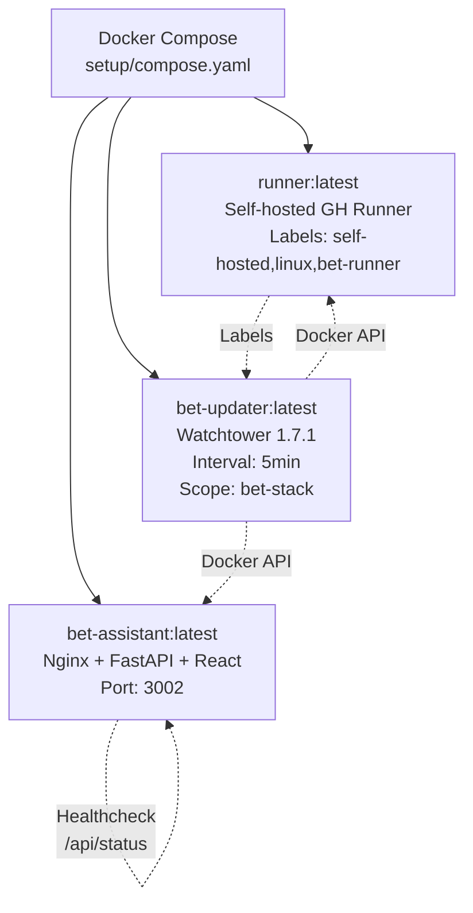

# Deployment Guide

## Overview

Bet Assistant supports multiple deployment strategies:

| Strategy | Use Case | Complexity |
|----------|----------|------------|
| **Docker Compose** (Recommended) | Single host, Raspberry Pi, VPS | Low |
| **Kubernetes** | Production clusters, HA | High |
| **Manual** | Development, debugging | Medium |

---

## Docker Compose Deployment (Recommended)

### Prerequisites

- Docker Engine 24+
- Docker Compose 2.20+
- 2GB+ RAM, 10GB+ disk
- Linux (tested on Ubuntu 22.04, Debian 12, Raspberry Pi OS)

### Quick Start

```bash
# 1. Clone repository
git clone https://github.com/rotarurazvan07/bet-assistant.git
cd bet-assistant

# 2. Configure environment (optional)
cp setup/env.example .env
# Edit .env with your GitHub credentials for self-hosted runners

# 3. Launch
docker compose -f setup/compose.yaml up -d

# 4. Verify
curl http://localhost:3002/api/status
# Open http://localhost:3002 in browser
```

### Services Started



### Configuration

#### Environment Variables (`.env`)

```bash
# GitHub (for self-hosted runners)
GITHUB_OWNER=your-github-username
GITHUB_REPO=bet-assistant
ACCESS_TOKEN=ghp_xxxxxxxxxxxx
RUNNER_LABELS=self-hosted,linux,bet-runner

# Application (optional overrides)
MATCHES_DB_PATH=/app/workspace/data/matches.db
SLIPS_DB_PATH=/app/workspace/data/slips.db
CONFIG_PATH=/app/workspace/config
TZ=Europe/Bucharest
PYTHONPATH=/app
```

#### Data Persistence

The `workspace/` directory is created on first run:

```
workspace/
├── config/          # Copied from /app/config/ on first launch
│   ├── scraper_config.yaml
│   ├── similarity_config.yaml
│   └── profiles/
│       ├── low_risk.yaml
│       ├── medium_risk.yaml
│       ├── high_risk.yaml
│       └── value_hunter.yaml
└── data/
    ├── matches.db   # Match data + odds history
    └── slips.db     # Slip storage
```

**Important**: After first launch, edit files in `./workspace/config/` to customize settings. The container copies defaults from `/app/config/` only on first run.

### Ports

| Service | Internal | External | Description |
|---------|----------|----------|-------------|
| Nginx | 80 | 3002 | Main dashboard |
| FastAPI | 8000 | - | Internal only |
| Watchtower | - | - | Docker socket |

To change the external port, edit `setup/compose.yaml`:

```yaml
services:
  bet-assistant:
    ports:
      - "8080:80"  # Change 3002 to 8080
```

### Health Checks

```bash
# Service health
docker compose -f setup/compose.yaml ps

# Application health
curl http://localhost:3002/api/status
# {"last_pull": "2026-08-22T05:30:00", "matches_loaded": 1247}

# Detailed logs
docker compose -f setup/compose.yaml logs -f bet-assistant
```

### Updating

**Automatic** (via Watchtower):
- Checks every 5 minutes for new images
- Only updates services with label `com.centurylinklabs.watchtower.scope=bet-stack`
- Preserves `workspace/` data

**Manual**:
```bash
# Pull latest images
docker compose -f setup/compose.yaml pull

# Restart with new images
docker compose -f setup/compose.yaml up -d
```

### Backup & Restore

```bash
# Backup
cp -r workspace/ workspace-backup-$(date +%Y%m%d)/

# Restore
docker compose -f setup/compose.yaml down
rm -rf workspace/
cp -r workspace-backup-20260822/ workspace/
docker compose -f setup/compose.yaml up -d
```

---

## Kubernetes Deployment

### Prerequisites

- Kubernetes 1.28+
- Helm 3.12+
- Ingress controller (nginx-ingress)
- PersistentVolume provisioner
- cert-manager for TLS

### Helm Chart Structure

```
bet-assistant/
├── Chart.yaml
├── values.yaml
├── templates/
│   ├── deployment.yaml
│   ├── service.yaml
│   ├── ingress.yaml
│   ├── configmap.yaml
│   ├── secret.yaml
│   ├── pvc.yaml
│   ├── cronjob-scrape.yaml
│   └── cronjob-validate.yaml
└── values-prod.yaml
```

### Key Kubernetes Resources

#### Deployment

```yaml
# templates/deployment.yaml
apiVersion: apps/v1
kind: Deployment
metadata:
  name: bet-assistant
spec:
  replicas: 2
  selector:
    matchLabels:
      app: bet-assistant
  template:
    metadata:
      labels:
        app: bet-assistant
    spec:
      containers:
      - name: bet-assistant
        image: ghcr.io/rotarurazvan07/bet-assistant:latest
        ports:
        - containerPort: 80
        envFrom:
        - configMapRef:
            name: bet-assistant-config
        - secretRef:
            name: bet-assistant-secrets
        volumeMounts:
        - name: workspace
          mountPath: /app/workspace
        livenessProbe:
          httpGet:
            path: /api/status
            port: 80
          initialDelaySeconds: 10
          periodSeconds: 10
        readinessProbe:
          httpGet:
            path: /api/status
            port: 80
          initialDelaySeconds: 5
          periodSeconds: 5
      volumes:
      - name: workspace
        persistentVolumeClaim:
          claimName: bet-assistant-workspace
```

#### CronJobs for Scraping

```yaml
# templates/cronjob-scrape.yaml
apiVersion: batch/v1
kind: CronJob
metadata:
  name: bet-assistant-scrape
spec:
  schedule: "0 */1 * * *"  # Hourly
  jobTemplate:
    spec:
      template:
        spec:
          containers:
          - name: scraper
            image: ghcr.io/rotarurazvan07/bet-assistant-runner:latest
            envFrom:
            - configMapRef:
                name: bet-assistant-config
            - secretRef:
                name: bet-assistant-secrets
            command:
            - python
            - -m
            - bet_crawler.crawl
            - --mode
            - prepare-scrape
            - --runners
            - actions
            - --config_dir
            - /app/config
          restartPolicy: OnFailure
          volumes:
          - name: workspace
            persistentVolumeClaim:
              claimName: bet-assistant-workspace
```

#### Ingress with TLS

```yaml
# templates/ingress.yaml
apiVersion: networking.k8s.io/v1
kind: Ingress
metadata:
  name: bet-assistant
  annotations:
    cert-manager.io/cluster-issuer: letsencrypt-prod
    nginx.ingress.kubernetes.io/proxy-body-size: "10m"
    nginx.ingress.kubernetes.io/proxy-read-timeout: "300"
    nginx.ingress.kubernetes.io/proxy-send-timeout: "300"
spec:
  tls:
  - hosts:
    - bet-assistant.example.com
    secretName: bet-assistant-tls
  rules:
  - host: bet-assistant.example.com
    http:
      paths:
      - path: /
        pathType: Prefix
        backend:
          service:
            name: bet-assistant
            port:
              number: 80
```

### Install

```bash
# Add repo (if published)
helm repo add bet-assistant https://rotarurazvan07.github.io/bet-assistant-helm
helm repo update

# Install
helm install bet-assistant bet-assistant/bet-assistant \
  -f values-prod.yaml \
  --namespace bet-assistant \
  --create-namespace

# Or install from local chart
helm install bet-assistant ./bet-assistant \
  -f values-prod.yaml \
  --namespace bet-assistant \
  --create-namespace
```

### Production Values (`values-prod.yaml`)

```yaml
image:
  repository: ghcr.io/rotarurazvan07/bet-assistant
  tag: latest
  pullPolicy: Always

replicaCount: 2

resources:
  limits:
    cpu: 1000m
    memory: 1Gi
  requests:
    cpu: 500m
    memory: 512Mi

autoscaling:
  enabled: true
  minReplicas: 2
  maxReplicas: 5
  targetCPUUtilizationPercentage: 70

ingress:
  enabled: true
  className: nginx
  annotations:
    cert-manager.io/cluster-issuer: letsencrypt-prod
  hosts:
  - host: bet-assistant.example.com
    paths:
    - path: /
      pathType: Prefix
  tls:
  - secretName: bet-assistant-tls
    hosts:
    - bet-assistant.example.com

persistence:
  enabled: true
  storageClass: fast-ssd
  size: 10Gi

config:
  scraper_config: |-
    # Your scraper_config.yaml content
  similarity_config: |-
    # Your similarity_config.yaml content

secrets:
  github_token: "ghp_xxxxxxxxxxxx"
  github_owner: "your-username"
  github_repo: "bet-assistant"
```

---

## Raspberry Pi Deployment

### Hardware Requirements

- Raspberry Pi 4 (4GB or 8GB RAM recommended)
- 32GB+ microSD (Class 10 / A2) or SSD via USB 3.0
- Stable power supply (3A+)
- Ethernet connection preferred

### OS Setup

```bash
# Raspberry Pi OS Lite (64-bit)
sudo apt update && sudo apt upgrade -y
sudo apt install -y docker.io docker-compose-plugin
sudo usermod -aG docker $USER
newgrp docker
```

### Optimizations for Pi

```yaml
# docker-compose.override.yml
services:
  bet-assistant:
    deploy:
      resources:
        limits:
          memory: 1.5G
        reservations:
          memory: 512M
    environment:
      - PYTHONUNBUFFERED=1
      - PYTHONDONTWRITEBYTECODE=1
  runner:
    deploy:
      resources:
        limits:
          memory: 512M
  bet-updater:
    deploy:
      resources:
        limits:
          memory: 128M
```

```bash
docker compose -f setup/compose.yaml -f docker-compose.override.yml up -d
```

### Swap Configuration

```bash
# Increase swap for memory-intensive operations
sudo dphys-swapfile swapoff
sudo sed -i 's/CONF_SWAPSIZE=100/CONF_SWAPSIZE=2048/' /etc/dphys-swapfile
sudo dphys-swapfile setup
sudo dphys-swapfile swapon
```

---

## Production Checklist

### Security

- [ ] Change default ports (3002 → 80/443 via reverse proxy)
- [ ] Enable TLS with valid certificates (Let's Encrypt)
- [ ] Configure firewall (ufw allow 80,443,22)
- [ ] Use strong GitHub PAT with minimal scopes
- [ ] Disable Docker API exposure (Watchtower uses socket mount)
- [ ] Set `HOST=127.0.0.1` in backend (default)
- [ ] Regular security updates: `docker compose pull && docker compose up -d`

### Monitoring

- [ ] Enable Docker health checks (configured)
- [ ] Set up log aggregation (Loki, ELK, or Docker logging driver)
- [ ] Monitor disk space (SQLite grows over time)
- [ ] Alert on container restarts
- [ ] Track GitHub Actions workflow success rate

### Performance

- [ ] Use SSD storage for `workspace/data/`
- [ ] Configure Nginx caching for static assets
- [ ] Enable gzip/brotli compression
- [ ] Set appropriate resource limits
- [ ] Consider PostgreSQL for high-load scenarios

### Reliability

- [ ] Multiple self-hosted runner replicas
- [ ] Database backup schedule (daily)
- [ ] Disaster recovery plan documented
- [ ] Staging environment for testing updates

---

## Environment-Specific Configurations

### Development

```bash
# Frontend dev server (hot reload)
cd bet_dashboard/frontend
npm run dev  # http://localhost:5173

# Backend dev server (hot reload)
cd bet_dashboard/backend
uvicorn main:app --reload --port 8000

# Crawler test
python -m bet_crawler.crawl --mode prepare-scrape --runners test --config_dir config
```

### Staging

```bash
# Use staging compose file
docker compose -f setup/compose.yaml -f setup/compose.staging.yaml up -d
```

### Production

```bash
# Use production compose with overrides
docker compose -f setup/compose.yaml -f setup/compose.prod.yaml up -d
```

---

## Troubleshooting Deployment

### Container Won't Start

```bash
# Check logs
docker compose -f setup/compose.yaml logs bet-assistant

# Common issues:
# 1. Port 3002 in use → change port in compose.yaml
# 2. Permission denied on workspace/ → chown -R 1000:1000 workspace/
# 3. Missing config → first run creates workspace/config/ from defaults
```

### Database Issues

```bash
# Check database integrity
sqlite3 workspace/data/matches.db "PRAGMA integrity_check;"
sqlite3 workspace/data/slips.db "PRAGMA integrity_check;"

# Check table counts
sqlite3 workspace/data/matches.db "SELECT COUNT(*) FROM matches;"
sqlite3 workspace/data/slips.db "SELECT COUNT(*) FROM slips;"
```

### Self-Hosted Runner Not Connecting

```bash
# Check runner logs
docker compose -f setup/compose.yaml logs runner

# Verify GitHub token has correct scopes:
# repo, workflow, admin:org (for runner registration)

# Re-register runner
docker compose -f setup/compose.yaml restart runner
```

### Watchtower Not Updating

```bash
# Check Watchtower logs
docker compose -f setup/compose.yaml logs bet-updater

# Verify labels on services
docker inspect bet-assistant | grep -A5 Labels
# Should have: com.centurylinklabs.watchtower.scope=bet-stack

# Force update
docker compose -f setup/compose.yaml pull && docker compose -f setup/compose.yaml up -d
```

---

## Rollback Procedure

```bash
# 1. List available images
docker images ghcr.io/rotarurazvan07/bet-assistant

# 2. Tag previous version
docker tag ghcr.io/rotarurazvan07/bet-assistant:previous ghcr.io/rotarurazvan07/bet-assistant:latest

# 3. Restart
docker compose -f setup/compose.yaml up -d --force-recreate

# 4. Verify
curl http://localhost:3002/api/status
```

---

## Scaling Considerations

| Component | Horizontal Scaling | Notes |
|-----------|-------------------|-------|
| Frontend (Nginx + React) | Yes | Static files, stateless |
| Backend (FastAPI) | With Redis | WebSocket needs pub/sub |
| Crawler | Yes | GitHub Actions matrix |
| Database | No (SQLite) | Migrate to PostgreSQL |
| Runner | Yes | Multiple replicas |

For high availability, migrate SQLite to PostgreSQL and add Redis for WebSocket scaling.
