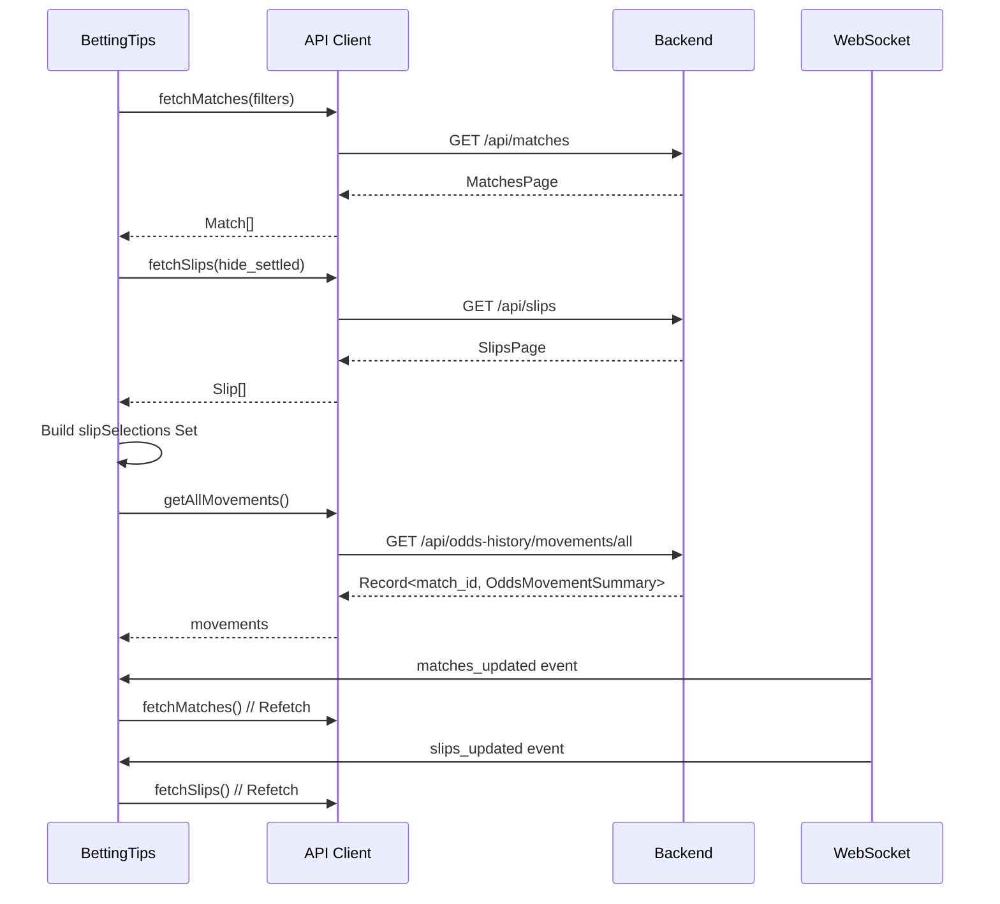

# Frontend Documentation

## Overview

The Bet Assistant frontend is a **React 19 + TypeScript** single-page application built with **Vite**, featuring a premium dashboard with 5 main tabs, real-time WebSocket updates, and a glassmorphism design system using **MUI v9** and **TailwindCSS**.

**Tech Stack**:
- React 19.2.4
- TypeScript 6.0.2
- Vite 8.0.4
- MUI v9 (Material UI) + @mui/x-date-pickers
- TailwindCSS 3.4.19
- Recharts 3.8.1 (charting)
- Axios 1.14.0 (API client)
- React Router 7.14.0 (routing)
- Day.js 1.11.20 (date handling)
- ESLint 9 + TypeScript ESLint

---

## Architecture

```mermaid
graph TD
    App[App.tsx
    BrowserRouter + WS Provider]
    
    Layout[Layout.tsx
    Global Filters + Tab Navigation]
    
    Pages[Pages/ 5 Dashboard Tabs]
    BT[BettingTips.tsx
    Match Table + Filters + Slip Builder]
    SB[SmartBuilder.tsx
    Config Panel + Live Preview]
    SL[Slips.tsx
    Slip Cards + Filters + Actions]
    AN[Analytics.tsx
    Charts + Metrics Dashboard]
    SV[Services.tsx
    Service Cards + Schedule]
    
    Components[Components/]
    UI[ui.tsx
    Base: Tooltip, Toggle, Badge, Card, StatCard]
    MR[MatchRow.tsx
    Clickable Market Cells]
    FP[FloatingSlipBuilder.tsx
    Side Panel - Manual Slip Builder]
    BP[BuilderPanel.tsx
    Smart Builder Configuration]
    AD[AnalyticsDashboard.tsx
    Chart Containers]
    SC[ServiceCard.tsx
    Toggle + Status + Next Run]
    
    Hooks[Hooks/]
    US[useSocket.ts
    WS Connection + Auto-reconnect + Ping]
    UP[useProfileSelection.ts
    Profile State Management]
    
    API[API/]
    CL[client.ts
    Axios Instance + Interceptors]
    DT[data.ts
    Builder, Profiles, Slips, Analytics, Services]
    MT[matches.ts
    Match Fetching]
    OH[oddsHistory.ts
    Movement Data]
    
    Config[Config/]
    MC[marketConfig.ts
    Market Columns + Types + Validation]
    
    Types[Types/]
    IDX[index.ts
    All TypeScript Interfaces]
    
    Utils[Utils/]
    BU[betUtils.ts
    Formatting Helpers]
    CU[calculationUtils.ts
    Math Helpers]
    TU[teamUtils.ts
    Team Name Normalization]
    
    App --> Layout
    Layout --> Pages
    Pages --> BT
    Pages --> SB
    Pages --> SL
    Pages --> AN
    Pages --> SV
    
    BT --> Components
    SB --> Components
    SL --> Components
    AN --> Components
    SV --> Components
    
    Components --> UI
    Components --> MR
    Components --> FP
    Components --> BP
    Components --> AD
    Components --> SC
    
    BT --> Hooks
    SB --> Hooks
    SL --> Hooks
    AN --> Hooks
    SV --> Hooks
    
    Hooks --> US
    Hooks --> UP
    
    BT --> API
    SB --> API
    SL --> API
    AN --> API
    SV --> API
    
    API --> CL
    API --> DT
    API --> MT
    API --> OH
    
    SB --> Config
    BT --> Config
    
    All --> Types
    All --> Utils
```



---

## Pages Deep Dive

### 1. Betting Tips (`BettingTips.tsx`)

**Purpose**: Display all matches with consensus predictions and odds, with manual slip building.

**Key Features**:
- Virtualized match table (40 rows/page)
- Column sorting (all consensus/odds columns)
- Multi-filter: search, date range, min consensus, min odds, significant movement
- Click-to-add market cells → FloatingSlipBuilder side panel
- Odds movement indicators (up/down/stable with strength %)
- Slip selection highlighting (shows which cells already in pending slips)
- Column visibility toggle (persisted)
- Slip panel minimize/expand (persisted)
- Full state persistence to localStorage

**State Management**:
```typescript
// Local filter state (persisted)
const [search, setSearch] = useState(() => loadFromStorage('search'));
const [minConsensus, setMinConsensus] = useState(...);
const [page, setPage] = useState(...);
const [sortBy, setSortBy] = useState(...);

// Slip builder state (persisted)
const [pendingLegs, setPendingLegs] = useState(() => loadFromStorage('pendingLegs'));

// Slip selections from backend (refetched on refreshKey)
const [slipSelections, setSlipSelections] = useState<Set<string>>(new Set());

// Odds movements (refetched on refreshKey)
const [movements, setMovements] = useState<Record<string, OddsMovementSummary>>({});
```

**Data Flow**:


### 2. Smart Builder (`SmartBuilder.tsx`)

**Purpose**: Configure risk profiles and generate slip previews in real-time.

**Configuration Sections**:
- **Bet Shape**: Target Odds, Target Legs, Max Overflow Legs
- **Quality Gate**: Consensus Floor, Min Odds
- **Markets**: 18 market checkboxes (1, X, 2, O/U 0.5-4.5, BTTS, Double Chance)
- **Tolerance & Stop**: Tolerance Factor, Stop Threshold, Min Legs Fill Ratio
- **Scoring**: Quality vs Balance, Consensus vs Sources (dual sliders 0-1)
- **Advanced**: Consensus Shrinkage K, Min Source Edge, Max Single Leg Odds, Asymmetric Tolerance, Balance Decay, Min Pick Quality, Odds Movement Weight/Strength

**State Management**:
```typescript
// Full config state (persisted)
const [cfg, setCfg] = useState<BuilderConfig>(() => loadFromStorage('cfg'));
const [activeName, setActiveName] = useState(...);
const [units, setUnits] = useState(...);
const [runDaily, setRunDaily] = useState(...);
const [targetPayout, setTargetPayout] = useState(...);

// Preview state
const [preview, setPreview] = useState<PreviewResult | null>(null);
const [loading, setLoading] = useState(false);

// Profiles & Excluded
const [profiles, setProfiles] = useState<ProfilesMap>({});
const [excludedDetails, setExcludedDetails] = useState<ExcludedMatch[]>([]);
const [availableLeagues, setAvailableLeagues] = useState<string[]>([]);
```

**Debounced Preview**:
- 350ms debounce on config changes
- Auto-triggers on global filter changes (date range)
- Auto-calculates units from target payout using live preview odds

**Profile Management**:
- Save/Load/Delete profiles (persisted to backend)
- Run daily count (0-24) for automated generation
- Target payout auto-calculates units

### 3. Slips (`Slips.tsx`)

**Purpose**: View, filter, and manage all betting slips.

**Features**:
- Slip cards with profile, units, total odds, status badge
- Expandable leg details with live scores
- Filters: profile dropdown, hide settled, live only
- Actions: Validate Results, Generate Slips
- Delete pending slips

### 4. Analytics (`Analytics.tsx`)

**Purpose**: Comprehensive performance visualization with 8 chart types.

**Charts**:
1. **Cumulative Net Profit** - Line chart over time
2. **Win Rate** - Cumulative vs Rolling 10
3. **ROI % Over Time** - Line chart
4. **Net Profit by Market** - Horizontal bar chart
5. **Market Accuracy** - Stacked bar (Won/Lost)
6. **Win Rate by Legs Count** - Bar chart
7. **Profile Scatter** - Avg Odds vs Win Rate (bubble = volume)
8. **Rolling Edge Trend** - Line chart
9. **Drawdown** - Area chart
10. **Return Distribution** - Histogram
11. **Time Patterns** - Day of week / Hour heatmaps
12. **Correlation Matrix** - League × Market heatmap

**Components**: Uses `AnalyticsDashboard.tsx` with Recharts.

### 5. Services (`Services.tsx`)

**Purpose**: Manage automated background crawler services.

**Features**:
- Service cards with toggle (enabled/disabled)
- Live status indicator (green pulsing dot)
- Last run timestamp + match count
- Scheduled hours configuration (Pull DB, Generate Slips)
- Real-time updates via WebSocket

---

## Components Reference

### Base UI Components (`ui.tsx`)

| Component | Purpose | Key Props |
|-----------|---------|-----------|
| `Tooltip` | Portal-based tooltip (ignores overflow) | `text`, `children`, `align` |
| `TooltipIcon` | Question mark icon with tooltip | `text`, `align` |
| `LiveDot` | Animated status indicator | `alive`, `enabled` |
| `StatCard` | Metric display card | `label`, `value`, `sub`, `positive/negative/accent` |
| `Toggle` | Switch component | `checked`, `onChange`, `label` |
| `SectionHeader` | Consistent section titles | `icon`, `title`, `sub` |
| `StatusBadge` | Status with color coding | `status` (Won/Lost/Pending/Live) |

### MatchRow (`MatchRow.tsx`)

**Purpose**: Single match row in betting tips table with clickable market cells.

**Features**:
- Click any consensus/odds cell → add to FloatingSlipBuilder
- Odds movement indicator (up/down/stable badge)
- Significant movement highlight
- Slip selection highlight (already in pending slip)
- Column visibility respect
- Loading skeleton state

### FloatingSlipBuilder (`FloatingSlipBuilder.tsx`)

**Purpose**: Persistent side panel for manual slip building.

**Features**:
- Draggable/minimizable panel
- Leg list with match, market, odds, datetime
- Running total odds calculation
- Remove individual legs
- Submit with units → creates slip via API
- Persisted minimize state

### BuilderPanel (`BuilderPanel.tsx`)

**Purpose**: Smart Builder configuration form.

**Sections**:
- Bet Shape (target odds, legs, overflow)
- Quality Gate (consensus floor, min odds)
- Markets (checkbox grid)
- Tolerance & Stop (factor, threshold, fill ratio)
- Scoring (dual sliders)
- Advanced (collapsible)
- Profiles (save/load/delete)
- Excluded Matches (list + clear)
- Live Preview (BetPreview component)

### AnalyticsDashboard (`AnalyticsDashboard.tsx`)

**Purpose**: Container for all analytics charts.

**Chart Components** (using Recharts):
- `LineChart` + `AreaChart` for time series
- `BarChart` + `HorizontalBarChart` for comparisons
- `ScatterChart` for profile analysis
- `PieChart` for market distribution
- Responsive containers with tooltips
- Custom formatters for currency, percentages

### ServiceCard (`ServiceCard.tsx`)

**Purpose**: Individual service management card.

**Features**:
- Toggle switch with live status dot
- Description tooltip
- Next run countdown (hour-based or interval)
- Last generation timestamp
- Enabled/disabled styling

---

## Hooks

### `useSocket` (`hooks/useSocket.ts`)

**Purpose**: WebSocket connection manager with auto-reconnect.

```typescript
export function useSocket(handlers: Partial<Record<WsEventName, (ev: WsEvent) => void>>)
```

**Features**:
- Single WebSocket per mount
- Auto-reconnect (3s delay)
- Ping interval (25s) for proxy keepalive
- Event dispatch to handlers
- Cleanup on unmount

**Events Handled**:
- `matches_updated` → refetch matches
- `slips_updated` → refetch slips + analytics
- `service_toggled` → refetch services
- `pong` → connection alive

### `useProfileSelection` (`hooks/useProfileSelection.ts`)

**Purpose**: Manage active profile state for Smart Builder.

```typescript
export function useProfileSelection() {
  const [activeProfile, setActiveProfile] = useState<string>('manual');
  const [profiles, setProfiles] = useState<ProfilesMap>({});
  // ... load, save, delete helpers
}
```

---

## API Client (`api/`)

### `client.ts`

Axios instance with base URL `/api` and JSON headers.

### `data.ts`

Main API functions grouped by domain:

| Domain | Functions |
|--------|-----------|
| **Builder** | `fetchPreview`, `fetchLeagues`, `fetchExcluded`, `fetchExcludedDetails`, `addExcluded`, `removeExcluded`, `clearExcluded` |
| **Profiles** | `fetchProfiles`, `saveProfile`, `deleteProfile` |
| **Slips** | `fetchSlips`, `addSlip`, `deleteSlip`, `validateSlips`, `generateSlips` |
| **Analytics** | `fetchAnalytics` |
| **Services** | `fetchServices`, `saveServiceSettings`, `toggleService` |
| **System** | `pullDb`, `fetchStatus` |

### `matches.ts`

`fetchMatches(params)` - Paginated, filtered match fetching.

### `oddsHistory.ts`

`getAllMovements()`, `getSignificantMovements()` - Odds movement data.

---

## Configuration

### `marketConfig.ts`

**Single source of truth for market columns** - reorder here to change table column order.

```typescript
export const MARKET_COLUMNS: MarketColumn[] = [
  { market: '1', label: '1', consKey: 'cons_home', oddsKey: 'odds_home', marketType: 'result' },
  { market: 'X', label: 'X', consKey: 'cons_draw', oddsKey: 'odds_draw', marketType: 'result' },
  // ... 18 total markets
];
```

**Exports**:
- `MARKET_COLUMNS` - Ordered array
- `ALLOWED_MARKETS` - Set for validation
- `ALL_MARKETS` - Array of market identifiers
- `FIXED_COLUMNS` - Non-market columns (datetime, home, away, sources, league)
- `getTableColumns()` - Combined column list

---

## TypeScript Types (`types/index.ts`)

### Core Interfaces

```typescript
// Match from backend
export interface Match {
  match_id: string;
  datetime: string | null;
  home: string;
  away: string;
  sources: number;
  cons_home: number; cons_draw: number; cons_away: number;
  cons_over_25: number; cons_under_25: number;
  cons_btts_yes: number; cons_btts_no: number;
  // ... all 18 consensus fields
  odds_home: number; odds_draw: number; odds_away: number;
  // ... all 18 odds fields
  result_url: string | null;
  league: string | null;
}

// Builder configuration
export interface BuilderConfig {
  target_odds: number;
  target_legs: number;
  max_legs_overflow: number | null;
  consensus_floor: number;
  min_odds: number;
  included_markets: string[] | null;
  included_leagues: string[] | null;
  tolerance_factor: number | null;
  stop_threshold: number | null;
  min_legs_fill_ratio: number;
  quality_vs_balance: number;
  consensus_vs_sources: number;
  date_from: string | null;
  date_to: string | null;
  // Advanced fields...
}

// Preview result
export interface PreviewResult {
  legs: CandidateLeg[];
  total_odds: number;
  pending_urls: string[];
}

// Candidate leg
export interface CandidateLeg {
  match_name: string;
  datetime: string | null;
  market: string;
  market_type: string;
  consensus: number;
  odds: number;
  result_url: string | null;
  league?: string | null;
  sources: number;
  tier: number;
  score: number;
  odds_movement_direction?: OddsMovementDirection;
  odds_movement_strength?: number;
}
```

### Analytics Types

- `HistoryRecord` - Daily P&L tracking
- `MarketAccuracy` - Won/Lost/Total per market
- `PnlByMarket` - Net profit per market
- `OddsDistBucket` - Odds distribution histogram
- `CorrelationRecord` - Legs vs odds vs profit
- `ProfileScatterPoint` - Profile performance scatter
- `MarketBreakdown` - Detailed market stats
- `LeagueBreakdown` - Detailed league stats
- `RollingEdgePoint` - Rolling edge over time
- `DrawdownPoint` - Drawdown tracking
- `ReturnDistribution` - Histogram bins
- `TimePatternItem` - Day/hour patterns
- `AnalyticsData` - Combined analytics response

### Services Types

- `ServiceInfo` - Individual service status
- `ServicesData` - All services + schedule

### WebSocket Types

- `WsEventName` - Union of event names
- `WsEvent` - Event payload

### Odds History Types

- `OddsSnapshot` - Timestamp + odds object
- `OddsHistory` - Match ID + snapshots + movement

---

## Styling & Design System

### CSS Variables (`index.css`)

```css
:root {
  /* Colors */
  --bg-base: #0d1117;
  --bg-raised: #161b22;
  --bg-hover: #1f2428;
  --border: #30363d;
  --border-strong: #484f58;
  --text-bright: #e6edf3;
  --text-secondary: #8b949e;
  --accent: #58a6ff;
  --win: #3fb950;
  --loss: #f85149;
  --live: #d29922;
  --shadow-lg: 0 8px 32px rgba(0,0,0,0.4);
  
  /* Glassmorphism */
  --glass-bg: rgba(13, 17, 23, 0.8);
  --glass-border: rgba(48, 54, 61, 0.5);
}
```

### Tailwind Integration

```javascript
// tailwind.config.js
export default {
  content: ['./index.html', './src/**/*.{js,ts,jsx,tsx}'],
  theme: {
    extend: {
      colors: {
        'bg-base': 'var(--bg-base)',
        'bg-raised': 'var(--bg-raised)',
        // ...
      },
      fontFamily: {
        display: ['JetBrains Mono', 'monospace'],
        sans: ['Inter', 'sans-serif'],
      },
    },
  },
  plugins: [],
}
```

### MUI Theme

Custom theme in `App.tsx` with CSS variable integration for consistent design tokens.

---

## State Management Patterns

### Local Component State

```typescript
// Simple state with localStorage persistence
const [value, setValue] = useState(() => {
  const saved = localStorage.getItem('key');
  return saved ? JSON.parse(saved) : defaultValue;
});

useEffect(() => {
  localStorage.setItem('key', JSON.stringify(value));
}, [value]);
```

### Global Filters (Layout Context)

```typescript
// Layout.tsx provides dateFrom/dateTo to all pages
const [dateFrom, setDateFrom] = useState<string | null>(null);
const [dateTo, setDateTo] = useState<string | null>(null);

// Passed as props to page components
<BettingTips filters={{ dateFrom, dateTo }} refreshKey={refreshKey} />
```

### WebSocket-Driven Updates

```typescript
// Pages listen for WS events and refetch
export function useSocket(handlers) {
  // ... connection logic
  ws.onmessage = (e) => {
    const ev: WsEvent = JSON.parse(e.data);
    const handler = handlersRef.current[ev.event];
    if (handler) handler(ev);
  };
}

// In page component
useSocket({
  matches_updated: () => setRefreshKey(k => k + 1),
  slips_updated: (ev) => {
    setRefreshKey(k => k + 1);
    if (ev.live_data) setLiveData(ev.live_data);
  },
  service_toggled: () => setRefreshKey(k => k + 1),
});
```

---

## Performance Optimization

### Code Splitting

```typescript
// Lazy load pages
const BettingTips = lazy(() => import('./pages/BettingTips'));
const SmartBuilder = lazy(() => import('./pages/SmartBuilder'));
// ...

<Suspense fallback={<Loader />}>
  <Routes>
    <Route path="/" element={<BettingTips />} />
    // ...
  </Routes>
</Suspense>
```

### Memoization

```typescript
// Expensive computations
const filteredMatches = useMemo(() => 
  matches.filter(...), [matches, filters]
);

// Callback stability
const handleClick = useCallback((leg) => {
  // ...
}, [dependencies]);
```

### Virtualization

Match table uses CSS-based virtualization (fixed height container + overflow) rather than react-window for simplicity.

---

## Testing

```bash
# Unit tests
npm test

# Component tests
npm test -- --testPathPattern=components

# E2E tests (if configured)
npx playwright test
```

### Key Test Areas

- Market configuration validation
- Builder config serialization/deserialization
- WebSocket reconnection logic
- localStorage persistence
- Odds movement calculation
- Slip builder leg validation

---

## Building for Production

```bash
# Type check + build
npm run build
# Output: dist/

# Preview production build
npm run preview
```

### Docker Build

Multi-stage build in `setup/Dockerfile`:

```dockerfile
FROM node:22-alpine AS frontend-builder
WORKDIR /app
COPY bet_dashboard/frontend/package*.json ./
RUN npm ci
COPY bet_dashboard/frontend/ ./
RUN npm run build

# ... copied to nginx in final stage
```

---

## Troubleshooting

### Common Issues

| Issue | Solution |
|-------|----------|
| WS connection fails | Check backend running, CORS, proxy config |
| API calls 404 | Verify Vite proxy `/api` → `http://localhost:8000` |
| Styles not applying | Check Tailwind content paths, CSS variable definitions |
| Type errors | Run `npm run lint`, check `tsconfig.json` paths |
| Build fails | Clear `node_modules`, `npm ci`, check Node version |

### Debug Tools

- React DevTools (Components + Profiler)
- Redux DevTools (if using Redux)
- Network tab (API calls)
- WebSocket tab (WS frames)
- Console (React warnings, errors)
