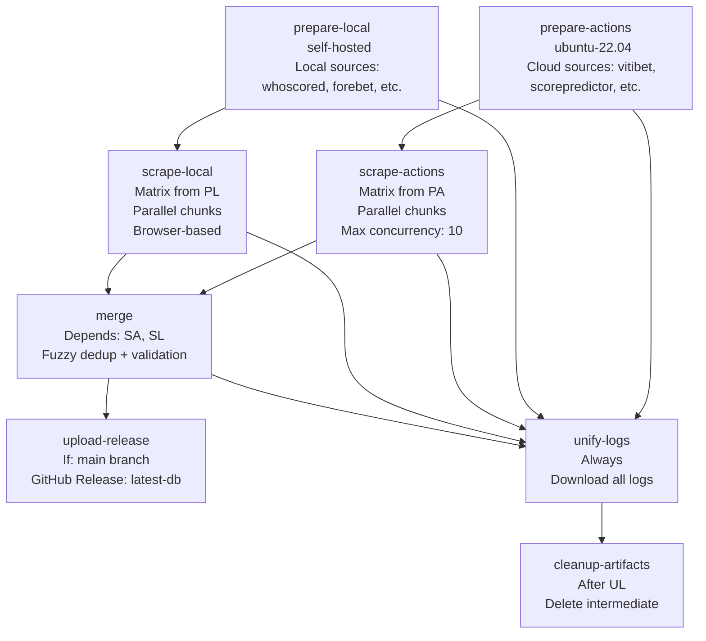
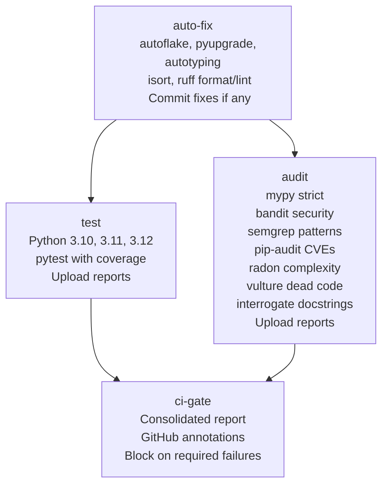

# Infrastructure Documentation

## Overview

Bet Assistant's infrastructure is built on **Docker** for containerization, **GitHub Actions** for CI/CD, and **self-hosted runners** for scraping workloads. The stack is designed to run on a single host (Raspberry Pi, VPS) or scale to Kubernetes.

**Components**:
- Docker multi-stage builds (Node 22 + Python 3.11)
- Docker Compose orchestration (3 services)
- GitHub Actions (3 workflows: scrape, deploy, CI)
- Watchtower for automatic container updates
- Nginx reverse proxy + static file serving
- GitHub Releases for database distribution

---

## Docker Architecture

### Multi-Stage Build (`setup/Dockerfile`)

```mermaid
graph TD
    subgraph "Stage 1: Frontend Builder"
        FB[FROM node:22-alpine
        WORKDIR /app
        COPY package*.json .
        RUN npm ci
        COPY . .
        RUN npm run build
        OUTPUT: /app/dist]
    end

    subgraph "Stage 2: Python Dependencies"
        PD[FROM python:3.11-slim
        ENV PIP_NO_CACHE_DIR=1
        RUN apt-get update && apt-get install -y gcc git
        COPY requirements.txt .
        RUN pip install --prefix=/install -r requirements.txt
        OUTPUT: /install]
    end

    subgraph "Stage 3: Runtime"
        RT[FROM python:3.11-slim
        WORKDIR /app
        COPY --from=PD /install /usr/local
        RUN scrapling install
        COPY bet_framework/ ./bet_framework/
        COPY bet_dashboard/backend/ .
        COPY config/ config/
        COPY --from=FB /app/dist /usr/share/nginx/html
        COPY nginx.conf /etc/nginx/sites-available/default
        COPY start-dashboard.sh /usr/local/bin/
        EXPOSE 80
        CMD ["/usr/local/bin/start-dashboard.sh"]]
    end

    FB --> RT
    PD --> RT
```

**Build Output**: ~500MB final image

### Docker Compose (`setup/compose.yaml`)

```yaml
services:
  bet-assistant:
    image: ghcr.io/rotarurazvan07/bet-assistant:latest
    container_name: bet-assistant
    restart: unless-stopped
    environment:
      - MATCHES_DB_PATH=/app/workspace/data/matches.db
      - SLIPS_DB_PATH=/app/workspace/data/slips.db
      - CONFIG_PATH=/app/workspace/config
      - PYTHONPATH=/app
      - TZ=Europe/Bucharest
    volumes:
      - ./workspace:/app/workspace
    ports:
      - "3002:80"
    labels:
      - "com.centurylinklabs.watchtower.enable=true"
      - "com.centurylinklabs.watchtower.scope=bet-stack"
    healthcheck:
      test: ["CMD", "python", "-c", "import urllib.request; urllib.request.urlopen('http://localhost/api/status')"]
      interval: 10s
      timeout: 5s
      retries: 5
      start_period: 10s

  runner:
    image: ghcr.io/rotarurazvan07/bet-assistant-runner:latest
    deploy:
      replicas: 1
    environment:
      GITHUB_OWNER: "${GITHUB_OWNER}"
      GITHUB_REPO: "${GITHUB_REPO}"
      ACCESS_TOKEN: "${ACCESS_TOKEN}"
      RUNNER_NAME_PREFIX: "bet-runner"
      LABELS: "${RUNNER_LABELS:-self-hosted,linux,bet-runner}"
    labels:
      - "com.centurylinklabs.watchtower.enable=true"
      - "com.centurylinklabs.watchtower.scope=bet-stack"

  bet-updater:
    image: containrrr/watchtower:1.7.1
    container_name: bet-updater
    restart: always
    environment:
      - DOCKER_API_VERSION=1.44
    volumes:
      - /var/run/docker.sock:/var/run/docker.sock
    command: --interval 300 --cleanup --scope bet-stack --label-enable
```

### Service Details

| Service | Image | Purpose | Ports | Volumes |
|---------|-------|---------|-------|---------|
| bet-assistant | bet-assistant:latest | Nginx + FastAPI + React | 3002:80 | ./workspace:/app/workspace |
| runner | bet-assistant-runner:latest | Self-hosted GH runner | - | - |
| bet-updater | watchtower:1.7.1 | Auto-update containers | - | /var/run/docker.sock |

### Nginx Configuration (`setup/nginx.conf`)

```nginx
server {
    listen 80;
    server_name localhost;
    root /usr/share/nginx/html;
    index index.html;

    # SPA routing
    location / {
        try_files $uri $uri/ /index.html;
    }

    # API proxy
    location /api/ {
        proxy_pass http://127.0.0.1:8000;
        proxy_http_version 1.1;
        proxy_set_header Upgrade $http_upgrade;
        proxy_set_header Connection 'upgrade';
        proxy_set_header Host $host;
        proxy_cache_bypass $http_upgrade;
        proxy_read_timeout 300s;
        proxy_send_timeout 300s;
    }

    # WebSocket proxy
    location /ws {
        proxy_pass http://127.0.0.1:8000;
        proxy_http_version 1.1;
        proxy_set_header Upgrade $http_upgrade;
        proxy_set_header Connection "upgrade";
        proxy_set_header Host $host;
        proxy_read_timeout 86400s;
        proxy_send_timeout 86400s;
    }

    # Static assets caching
    location ~* \.(js|css|png|jpg|jpeg|gif|ico|svg|woff|woff2)$ {
        expires 1y;
        add_header Cache-Control "public, immutable";
    }

    gzip on;
    gzip_types text/plain application/javascript application/json text/css;
}
```

### Entrypoint Script (`setup/start-dashboard.sh`)

```bash
#!/bin/bash
set -e

# Start nginx in background
nginx

# Start FastAPI with uvicorn
cd /app
exec uvicorn main:app --host 127.0.0.1 --port 8000 --workers 1
```

---

## Runner Dockerfile (`setup/runner.Dockerfile`)

```dockerfile
FROM ubuntu:22.04

# Install dependencies
RUN apt-get update && apt-get install -y \
    curl \
    git \
    jq \
    python3 \
    python3-pip \
    && rm -rf /var/lib/apt/lists/*

# Install GitHub Actions runner
RUN mkdir -p /actions-runner && cd /actions-runner && \
    curl -o actions-runner-linux-x64-2.311.0.tar.gz -L \
    https://github.com/actions/runner/releases/download/v2.311.0/actions-runner-linux-x64-2.311.0.tar.gz && \
    tar xzf actions-runner-linux-x64-2.311.0.tar.gz && \
    rm actions-runner-linux-x64-2.311.0.tar.gz && \
    ./bin/installdependencies.sh

# Entrypoint
COPY entrypoint.sh /entrypoint.sh
RUN chmod +x /entrypoint.sh
ENTRYPOINT ["/entrypoint.sh"]
```

---

## GitHub Actions Workflows

### 1. Scrape Workflow (`.github/workflows/scrape.yml`)

**Purpose**: Daily automated scraping pipeline (hourly schedule)

**Jobs**:



**Schedule**: `0 */1 * * *` (hourly)

**Key Features**:
- **Cloud/Local separation**: Different runner types for different source categories
- **Matrix strategy**: Parallel chunk processing (up to 10 concurrent)
- **Artifact passing**: URL files → chunk DBs → final DB
- **Release automation**: Upload final DB to GitHub Releases with tag `latest-db`
- **Log unification**: Single unified log for debugging
- **Cleanup**: Automatic artifact deletion after 7 days

### 2. Deploy Workflow (`.github/workflows/deploy.yml`)

**Purpose**: Build and push Docker images on push to main

```yaml
jobs:
  build-and-push:
    runs-on: ubuntu-latest
    permissions:
      contents: read
      packages: write
    steps:
      - uses: actions/checkout@v4
      - uses: docker/setup-buildx-action@v3
      - uses: docker/login-action@v3
        with:
          registry: ghcr.io
          username: ${{ github.actor }}
          password: ${{ secrets.GITHUB_TOKEN }}
      - uses: docker/build-push-action@v5
        with:
          context: .
          file: setup/Dockerfile
          push: true
          platforms: linux/amd64
          tags: ghcr.io/${{ github.repository_owner }}/bet-assistant:latest
          cache-from: type=gha,scope=bet-assistant
          cache-to: type=gha,mode=max,scope=bet-assistant
      - uses: docker/build-push-action@v5
        with:
          context: .
          file: setup/runner.Dockerfile
          push: true
          platforms: linux/amd64
          tags: ghcr.io/${{ github.repository_owner }}/bet-assistant-runner:latest
          cache-from: type=gha,scope=runner
          cache-to: type=gha,mode=max,scope=runner
```

**Images Published**:
- `ghcr.io/rotarurazvan07/bet-assistant:latest`
- `ghcr.io/rotarurazvan07/bet-assistant-runner:latest`

**Cache**: GitHub Actions cache for layer caching

### 3. CI Workflow (`.github/workflows/cicd.yml`)

**Purpose**: Comprehensive CI pipeline with auto-fix, test, audit, and gate



**Stages**:

| Stage | Tools | Purpose |
|-------|-------|---------|
| **Auto-fix** | autoflake, pyupgrade, autotyping, isort, ruff | Automatic code formatting & modernization |
| **Test** | pytest, pytest-cov, pytest-xdist | Unit/integration tests on Python 3.10/3.11/3.12 |
| **Audit** | mypy, bandit, semgrep, pip-audit, radon, vulture, interrogate | Security, types, complexity, docs |
| **Gate** | Consolidated report | Block merge on failures, annotate PR |

**Quality Gates**:
- Auto-fix must pass
- Tests must pass (coverage ≥ 10%)
- Audit is advisory (annotations only)
- Mypy errors → warning annotation
- Bandit issues → warning annotation
- Semgrep findings → warning annotation
- Pip-audit vulns → warning annotation
- Radon complexity → warning annotation
- Vulture dead code → notice annotation
- Interrogate < 80% → notice annotation

---

## Watchtower Auto-Updates

### Configuration

```yaml
bet-updater:
  image: containrrr/watchtower:1.7.1
  container_name: bet-updater
  restart: always
  environment:
    - DOCKER_API_VERSION=1.44
  volumes:
    - /var/run/docker.sock:/var/run/docker.sock
  command: --interval 300 --cleanup --scope bet-stack --label-enable
```

### Behavior

- **Interval**: 5 minutes (300 seconds)
- **Scope**: Only containers with label `com.centurylinklabs.watchtower.scope=bet-stack`
- **Label enable**: Only containers with `com.centurylinklabs.watchtower.enable=true`
- **Cleanup**: Remove old images after update
- **Zero-downtime**: Rolling update (stop old → start new)

### Target Services

```yaml
# bet-assistant
labels:
  - "com.centurylinklabs.watchtower.enable=true"
  - "com.centurylinklabs.watchtower.scope=bet-stack"

# runner
labels:
  - "com.centurylinklabs.watchtower.enable=true"
  - "com.centurylinklabs.watchtower.scope=bet-stack"
```

---

## GitHub Releases for Database Distribution

### Release Process

1. **Merge job** creates `final_matches.db`
2. **Upload-release job** (on main branch only):
   - Downloads final DB artifact
   - Creates/updates GitHub Release with tag `latest-db`
   - Uses `softprops/action-gh-release@v2`
   - `make_latest: true` for easy access

### Backend Consumption

```python
# In AppLogic.pull_matches_db()
repo = os.environ.get("REPO", "rotarurazvan07/bet-assistant")
url = f"https://github.com/{repo}/releases/download/latest-db/final_matches.db"

# ETag-based change detection
req = urllib.request.Request(url, method="HEAD")
with urllib.request.urlopen(req, timeout=15) as resp:
    etag = resp.headers.get("ETag")
    if etag and etag != self._last_etag:
        self._last_etag = etag
        return True  # Download new DB
```

### Benefits
- **CDN distribution**: GitHub's global CDN
- **Versioning**: Each release is immutable
- **Rollback**: Previous releases available
- **Bandwidth**: Efficient delta downloads via ETag

---

## Self-Hosted Runners

### Purpose

- **IP rotation**: Avoid rate limits on betting sites
- **Browser automation**: Cloudflare solving, JavaScript rendering
- **Cost control**: Free GitHub Actions minutes
- **Isolation**: Separate network from main application

### Runner Labels

```bash
LABELS=self-hosted,linux,bet-runner
```

### Runner Registration

```bash
# In runner container entrypoint
./config.sh --url https://github.com/${GITHUB_OWNER}/${GITHUB_REPO} \
    --token ${ACCESS_TOKEN} \
    --name ${RUNNER_NAME_PREFIX}-${HOSTNAME} \
    --labels ${LABELS} \
    --unattended \
    --replace

# Start runner
./run.sh
```

### Scaling

```yaml
# In compose.yaml
deploy:
  replicas: 2  # Increase for more parallel scraping
```

---

## Monitoring & Observability

### Health Checks

```yaml
# bet-assistant healthcheck
healthcheck:
  test: ["CMD", "python", "-c", "import urllib.request; urllib.request.urlopen('http://localhost/api/status')"]
  interval: 10s
  timeout: 5s
  retries: 5
  start_period: 10s
```

### Logging

```bash
# View all logs
docker compose -f setup/compose.yaml logs -f

# Specific service
docker compose -f setup/compose.yaml logs -f bet-assistant

# Follow with timestamps
docker compose -f setup/compose.yaml logs -f -t
```

### Metrics Collection

**Application Metrics** (via API):
- `GET /api/status` - Last pull, matches loaded
- `GET /api/services` - Service status, next run times
- `GET /api/analytics` - Betting performance metrics

**Infrastructure Metrics**:
- Docker stats: `docker stats`
- Container health: `docker compose ps`
- Disk usage: `df -h`
- Database size: `ls -lh workspace/data/`

### Alerting (Recommended)

```bash
# Container restart alert
watch -n 60 'docker compose ps --format "table {{.Name}}\t{{.Status}}"'

# Disk space alert
df -h | awk '$5 > 80 {print "WARNING: " $0}'

# Database growth monitoring
sqlite3 workspace/data/matches.db "SELECT COUNT(*) FROM matches;"
```

---

## Security

### Network Security

```nginx
# Nginx rate limiting (add to nginx.conf)
limit_req_zone $binary_remote_addr zone=api:10m rate=10r/s;
limit_req_zone $binary_remote_addr zone=ws:10m rate=5r/s;

location /api/ {
    limit_req zone=api burst=20 nodelay;
    # ...
}

location /ws {
    limit_req zone=ws burst=10 nodelay;
    # ...
}
```

### Container Security

- **Non-root user**: Runner runs as non-root
- **Read-only rootfs**: Where possible
- **Capability dropping**: Minimal capabilities
- **Secrets**: GitHub PAT via environment variables (not in image)

### CI/CD Security

- **GITHUB_TOKEN**: Least privilege (packages: write, contents: read)
- **Dependabot**: Automated dependency updates
- **CodeQL**: Static analysis (if enabled)
- **SBOM**: Software Bill of Materials via `docker/sbom-action`

---

## Backup & Disaster Recovery

### Backup Strategy

```bash
#!/bin/bash
# backup.sh - Run daily via cron

DATE=$(date +%Y%m%d_%H%M%S)
BACKUP_DIR="/backups/bet-assistant/$DATE"
mkdir -p $BACKUP_DIR

# Backup workspace (config + data)
tar -czf $BACKUP_DIR/workspace.tar.gz workspace/

# Backup Docker images
docker save ghcr.io/rotarurazvan07/bet-assistant:latest | gzip > $BACKUP_DIR/bet-assistant.tar.gz
docker save ghcr.io/rotarurazvan07/bet-assistant-runner:latest | gzip > $BACKUP_DIR/bet-assistant-runner.tar.gz

# Keep last 30 days
find /backups/bet-assistant -type d -mtime +30 -exec rm -rf {} \;
```

### Restore Procedure

```bash
# 1. Stop services
docker compose -f setup/compose.yaml down

# 2. Restore workspace
tar -xzf /backups/bet-assistant/20260822_020000/workspace.tar.gz

# 3. Load images (if needed)
docker load < /backups/bet-assistant/20260822_020000/bet-assistant.tar.gz
docker load < /backups/bet-assistant/20260822_020000/bet-assistant-runner.tar.gz

# 4. Start services
docker compose -f setup/compose.yaml up -d

# 5. Verify
curl http://localhost:3002/api/status
```

---

## Scaling Strategies

### Vertical Scaling

```yaml
# Increase resources in compose.yaml
services:
  bet-assistant:
    deploy:
      resources:
        limits:
          cpus: '2'
          memory: 2G
        reservations:
          cpus: '1'
          memory: 1G
```

### Horizontal Scaling (Kubernetes)

See [Deployment Guide](deployment.md#kubernetes-deployment) for Helm chart.

### Database Scaling

| Current | Target | Migration |
|---------|--------|-----------|
| SQLite | PostgreSQL | Add PG adapter, connection pooling |
| Single file | Read replicas | Primary + replicas |
| Embedded history | Separate tables | Normalize odds_history table |

### WebSocket Scaling

- **Current**: In-memory ConnectionManager
- **Target**: Redis pub/sub adapter
- **Implementation**: `ws_manager` with Redis backend

---

## Maintenance
## Routine Tasks

| Frequency | Task | Command |
|-----------|------|---------|
| Daily | Check scrape workflow | GitHub Actions UI |
| Daily | Verify database growth | `sqlite3 workspace/data/matches.db "SELECT COUNT(*) FROM matches;"` |
| Weekly | Update base images | `docker compose pull && docker compose up -d` |
| Weekly | Clean old artifacts | GitHub Actions auto-cleanup |
| Monthly | Review security advisories | `pip-audit`, `npm audit` |
| Monthly | Rotate GitHub PAT | GitHub Settings → Developer settings |

### Log Rotation

```bash
# Docker logging driver (in compose.yaml)
services:
  bet-assistant:
    logging:
      driver: "json-file"
      options:
        max-size: "10m"
        max-file: "5"
```

---

## Troubleshooting Infrastructure

### Common Issues

| Issue | Diagnosis | Resolution |
|-------|-----------|------------|
| Container restart loop | `docker compose logs` | Check healthcheck, port conflicts, permissions |
| Runner offline | `docker compose logs runner` | Re-register runner, check PAT scopes |
| Watchtower not updating | `docker compose logs bet-updater` | Verify labels, check Docker socket access |
| Database not updating | Check GitHub Release exists | Manual pull: `curl -X POST http://localhost:3002/api/pull` |
| High memory usage | `docker stats` | Reduce workers, enable chunked processing |
| Disk full | `df -h` | Clean old backups, prune Docker images |

### Debug Commands

```bash
# Full system status
docker compose -f setup/compose.yaml ps

docker compose -f setup/compose.yaml top

# Network inspection
docker network inspect bet-assistant_default

# Volume inspection
docker volume inspect bet-assistant_workspace

# Container inspection
docker inspect bet-assistant

# Resource usage
docker stats --no-stream
```

---

## Cost Optimization

### GitHub Actions
- **Self-hosted runners**: Free minutes for scraping
- **Cloud runners**: Only for prepare-actions (lightweight)
- **Matrix parallelization**: Reduces wall-clock time

### Docker
- **Multi-stage builds**: Minimal runtime images
- **Layer caching**: GitHub Actions cache for dependencies
- **Image pruning**: Watchtower `--cleanup` flag

### Hosting
- **Single host**: Raspberry Pi 4 (4GB) ~$50 + electricity
- **VPS**: 2 vCPU, 4GB RAM ~$20/month
- **Kubernetes**: Only when needed (HA, scaling)

---

## Future Improvements

| Area | Improvement | Effort |
|------|-------------|--------|
| **Observability** | Prometheus + Grafana dashboards | Medium |
| **Logging** | Loki + Promtail for log aggregation | Medium |
| **Tracing** | OpenTelemetry distributed tracing | High |
| **Secrets** | HashiCorp Vault or AWS Secrets Manager | Medium |
| **Database** | PostgreSQL with read replicas | High |
| **WebSocket** | Redis adapter for horizontal scaling | Medium |
| **CDN** | Cloudflare for static assets | Low |
| **IaC** | Terraform for infrastructure provisioning | Medium |
